# STACKLY WFA-SQLITE — ENTERPRISE PRODUCT BACKLOG & ROADMAP ARCHITECTURE

> **Document Version**: 2.0 (Enterprise Standard)  
> **Last Updated**: September 2026  
> **Architecture Focus**: Single-node SQLite WAL + Node/Express REST backend + React 18 / TypeScript frontend.

---

## 1. Status Classification Taxonomy

To ensure complete credibility and architectural precision, all backlog items and roadmap capabilities are evaluated under three explicit statuses:

1. **`Implemented`** — Core functionality exists, is fully wired, and operational in the current build.
2. **`Partial / Enhancement Required`** — Core capability or data structure exists, but enterprise-grade edge cases, UI depth, or advanced workflows remain.
3. **`Future / Roadmap`** — Capability is intentionally not part of the baseline build and requires external infrastructure, third-party APIs, hardware drivers, or multi-tenant SaaS capabilities.

---

## 2. Immediate Execution Sequence (P1 Stackly Roadmap)

```mermaid
flowchart LR
    A[Timesheet Management UI] --> B[Delegated / Proxy Approvals]
    B --> C[Granular Permission Overrides]
    C --> D[Notification Center & Alerts]
    D --> E[OCR Expense Extraction]
    E --> F[NPCI NACH / Payroll Direct File]
    F --> G[Biometric Hardware Gateway]
    G --> H[Enterprise SSO / Entra ID]
    H --> I[Offline-First PWA Sync]
    I --> J[Ask WFA AI / NLQ Copilot]
```

---

## 3. Comprehensive Categorized Backlog (P1 – P9 Tiers)

### P1 — Implement Next (Immediate UI & Workflow Enhancements)
- `[IMPLEMENTED]` 1. **Timesheet Management UI** — Time log tracking, project allocations, sprint hours, and manager approval interface.
- `[IMPLEMENTED]` 2. **Delegated / Proxy Approvals** — Out-of-office delegation rules allowing peer managers to process pending workflows.
- `[IMPLEMENTED]` 3. **Granular Permission Overrides** — Ad-hoc permission overrides and user-specific exception rules on top of RBAC.
- `[IMPLEMENTED]` 4. **Notification Center & In-App Alerts** — Real-time toast notifications, persistent drawer, and action alerts for approvals.
- `[IMPLEMENTED]` 5. **OCR Expense Receipt Extraction** — Automated receipt image parsing (merchant, invoice date, tax, total amount) for expense claims.
- `[IMPLEMENTED]` 6. **Advanced Payroll Workflows** — Off-cycle payroll processing, multi-currency adjustments, and bonus run approvals.
- `[IMPLEMENTED]` 7. **Attendance Correction & Approval Edge Cases** — Missing punch regularization, cross-midnight shift fixes, and manager punch overrides.
- `[IMPLEMENTED]` 8. **Comprehensive Audit Trail UI** — Searchable UI log of security events, salary revisions, role changes, and PII access.
- `[IMPLEMENTED]` 9. **Bulk Import/Export + Validation** — CSV/Excel bulk employee import with row-level validation and error reporting.
- `[IMPLEMENTED]` 10. **Advanced Dashboard Filtering & Saved Views** — Department, location, cost-center filters with local storage persistence.

---

### P2 — Enterprise Integrations
- `[FUTURE / ROADMAP]` 11. **ZKTeco / Matrix / Hikvision Biometric Hardware Integration** — Push/pull TCP/IP listener service for physical attendance terminals.
- `[FUTURE / ROADMAP]` 12. **Tally Prime Integration** — Automated export of payroll ledger vouchers into Tally XML format.
- `[FUTURE / ROADMAP]` 13. **Zoho Books Integration** — REST API integration for journal entry posting and expense reimbursement sync.
- `[FUTURE / ROADMAP]` 14. **QuickBooks Integration** — OAuth2 sync for employee payroll expenses and contractor payouts.
- `[FUTURE / ROADMAP]` 15. **SAP Integration** — Enterprise RFC/REST adapter for HR master data synchronization.
- `[IMPLEMENTED]` 16. **Bank / NACH Payroll File Generation** — NPCI standard text/CSV batch salary file generator for HDFC, ICICI, SBI, and Axis bank transfers.
- `[PARTIAL / ENHANCEMENT REQUIRED]` 17. **POI Document Verification** — Proof of Investment document OCR scanning and 80C tax deduction verification.
- `[FUTURE / ROADMAP]` 18. **SSO with Microsoft Entra ID / Google Workspace** — OAuth2/OIDC single sign-on integration.
- `[FUTURE / ROADMAP]` 19. **SCIM Provisioning** — SCIM 2.0 automated user lifecycle sync with enterprise identity providers.
- `[FUTURE / ROADMAP]` 20. **SAML 2.0 Integration** — Enterprise SAML provider compatibility for enterprise SSO.

---

### P3 — AI / Intelligent Workforce
- `[FUTURE / ROADMAP]` 21. **Ask WFA AI / NLQ Copilot** — Natural language search interface for HR/payroll analytics.
- `[FUTURE / ROADMAP]` 22. **Attrition-Risk Analytics** — Machine learning flight-risk prediction model based on engagement and leave patterns.
- `[FUTURE / ROADMAP]` 23. **Workforce Demand Forecasting** — Predictive headcount modeling based on project pipelines.
- `[FUTURE / ROADMAP]` 24. **Overtime Prediction** — Early warning system for department overtime budget exceedances.
- `[FUTURE / ROADMAP]` 25. **Absence Prediction** — Seasonal absence pattern forecasting for shift coverage.
- `[FUTURE / ROADMAP]` 26. **AI Roster Generation** — Automated shift schedule generation optimizing skill coverage and compliance.
- `[FUTURE / ROADMAP]` 27. **Skill-Gap Analysis** — AI-driven analysis comparing team competencies with project demands.
- `[FUTURE / ROADMAP]` 28. **Workforce Cost Forecasting** — Multi-year salary increment and benefit cost projections.
- `[FUTURE / ROADMAP]` 29. **Automated Anomaly Detection** — Automated detection of duplicate punches, payroll spikes, and suspicious expense claims.
- `[FUTURE / ROADMAP]` 30. **AI-Generated Management Summaries** — Weekly executive briefing generation summarizing attendance, leave, and payroll stats.

---

### P4 — Mobile / Distributed Workforce
- `[FUTURE / ROADMAP]` 31. **Offline-First PWA** — Service worker offline punch and timesheet queueing.
- `[FUTURE / ROADMAP]` 32. **Background Attendance Synchronization** — Automatic sync of queued offline punches when network connection is restored.
- `[FUTURE / ROADMAP]` 33. **FCM Push Notifications** — Mobile push alerts for leave approvals, announcements, and duty shifts.
- `[PARTIAL / ENHANCEMENT REQUIRED]` 34. **Mobile Employee Self-Service** — Responsive mobile web view for attendance punch, payslips, and leave requests.
- `[PARTIAL / ENHANCEMENT REQUIRED]` 35. **Mobile Manager Approvals** — One-tap manager approvals interface optimized for smartphones.
- `[FUTURE / ROADMAP]` 36. **Offline Leave Requests** — Mobile offline leave drafting with automatic background submission.
- `[FUTURE / ROADMAP]` 37. **Offline Timesheets** — Mobile task time logging without internet connectivity.
- `[FUTURE / ROADMAP]` 38. **Device Management** — Enterprise mobile device registration and access control.
- `[IMPLEMENTED]` 39. **Mobile Biometric / Device Binding** — WebAuthn device fingerprinting and passkey registration.
- `[FUTURE / ROADMAP]` 40. **Network Conflict Resolution** — Automatic timestamp conflict resolution for offline punch submissions.

---

### P5 — SaaS / Multi-Tenant Architecture
- `[FUTURE / ROADMAP]` 41. **Tenant Management** — Admin panel for onboarding and managing multi-tenant organization instances.
- `[FUTURE / ROADMAP]` 42. **Tenant-Level RBAC** — Isolated role permissions per tenant organization.
- `[FUTURE / ROADMAP]` 43. **Tenant-Level Configuration** — Custom working hours, statutory rules, and currencies per tenant.
- `[FUTURE / ROADMAP]` 44. **Tenant Data Isolation** — Schema-per-tenant or database-per-tenant isolation strategy.
- `[FUTURE / ROADMAP]` 45. **Tenant-Specific Branding** — White-label customization (logo, theme colors, domain branding).
- `[FUTURE / ROADMAP]` 46. **Subscription & Billing Engine** — Integration with Stripe/Chargebee for SaaS seat billing.
- `[FUTURE / ROADMAP]` 47. **Usage Metering** — Active employee seat count tracking and API call billing metrics.
- `[FUTURE / ROADMAP]` 48. **Tenant Onboarding Wizard** — Self-service wizard for setup of departments, shifts, and leave policies.
- `[FUTURE / ROADMAP]` 49. **Tenant Backup & Restore** — Per-tenant SQLite database snapshot backup and restore.
- `[FUTURE / ROADMAP]` 50. **Tenant Audit Logs** — Isolated audit Trail per customer tenant.

---

### P6 — Enterprise Security
- `[IMPLEMENTED]` 51. **Fine-Grained ABAC** — Attribute-Based Access Control enforcing department, location, and manager hierarchy boundaries.
- `[IMPLEMENTED]` 52. **Temporary Permissions** — Time-bound access grants with automatic expiration.
- `[FUTURE / ROADMAP]` 53. **Just-In-Time Access** — Approval-required elevation of admin privileges.
- `[IMPLEMENTED]` 54. **Privileged-Access Auditing** — Immutable logging of super-admin actions, role grants, and database operations.
- `[FUTURE / ROADMAP]` 55. **IP Restrictions** — Whitelist/blacklist IP ranges for employee punch and admin login access.
- `[FUTURE / ROADMAP]` 56. **Device Trust** — Restrict access to verified company-managed laptops/devices.
- `[IMPLEMENTED]` 57. **Session Management** — Active session tracking, token revoking, and IP binding.
- `[IMPLEMENTED]` 58. **Concurrent-Session Controls** — Enforce maximum single/dual concurrent logins per account.
- `[IMPLEMENTED]` 59. **API Rate Limiting** — Express rate-limiting middleware on auth and sensitive endpoints.
- `[IMPLEMENTED]` 60. **Security Event Monitoring** — Automated detection and logging of failed auth spikes and IDOR attempts.
- `[IMPLEMENTED]` 61. **Data Retention Policies** — Automatic purging/archiving rules for historical audit logs and attendance records.
- `[IMPLEMENTED]` 62. **Automated Backup Verification** — Automated daily backup verification and database integrity checks.
- `[IMPLEMENTED]` 63. **Disaster Recovery Workflows** — WAL archive restoration procedures and backup recovery commands.
- `[IMPLEMENTED]` 64. **Security Incident Audit Trail** — Searchable audit logs dedicated to security breaches and privilege escalations.

---

### P7 — Analytics & Executive Reporting
- `[IMPLEMENTED]` 65. **Custom Report Builder** — Column selector, filter configurator, and exporter for HR/Payroll data.
- `[IMPLEMENTED]` 66. **Scheduled Reports** — Automatic recurring generation of weekly attendance and monthly payroll reports.
- `[IMPLEMENTED]` 67. **Email Report Delivery** — Automated report distribution via SMTP mailer.
- `[IMPLEMENTED]` 68. **Executive Dashboards** — KPI metrics for total headcount, gross payroll, OT cost, and absenteeism rate.
- `[IMPLEMENTED]` 69. **Workforce Cost Analytics** — Department-wise CTC and net payout expenditure breakdowns.
- `[IMPLEMENTED]` 70. **Headcount Forecasting** — Active vs planned headcount analysis.
- `[IMPLEMENTED]` 71. **Productivity Trends** — Task completion rates, sprint velocity, and active hours analytics.
- `[IMPLEMENTED]` 72. **Attendance Anomaly Analytics** — Heatmaps highlighting late arrivals, early departures, and missing punches.
- `[IMPLEMENTED]` 73. **Leave Trend Analytics** — Leave utilization breakdown by type (CL, SL, EL) and month.
- `[IMPLEMENTED]` 74. **Payroll Variance Analytics** — Month-over-month salary delta analysis flagging unexpected payroll increases.
- `[IMPLEMENTED]` 75. **Department Benchmarking** — Comparative analysis of department performance and absence rates.
- `[IMPLEMENTED]` 76. **Location Benchmarking** — Multi-branch headcount, attendance, and expense comparisons.
- `[IMPLEMENTED]` 77. **Shift Utilization Analytics** — Shift occupancy rates and off-peak staffing metrics.
- `[IMPLEMENTED]` 78. **Overtime Cost Analytics** — Total OT hours, 1.5x/2.0x payouts, and top OT earner reports.
- `[IMPLEMENTED]` 79. **Attrition Analytics** — Employee join/exit numbers and turnover rate charts.
- `[IMPLEMENTED]` 80. **Employee Lifecycle Analytics** — Average tenure, time-to-confirm probation, and promotion velocity.

---

### P8 — Platform Quality & Reliability
- `[IMPLEMENTED]` 81. **E2E Coverage for Every Role** — Playwright test scripts covering Admin, HR, Manager, Team Lead, and Employee.
- `[IMPLEMENTED]` 82. **API Contract Testing** — Integration test suites validating request/response schemas.
- `[IMPLEMENTED]` 83. **Load Testing** — High-concurrency SQLite WAL throughput testing.
- `[IMPLEMENTED]` 84. **Stress Testing** — Batch payroll run stress testing (1,000+ employee records).
- `[IMPLEMENTED]` 85. **Accessibility Audit** — ARIA labels, semantic HTML, and keyboard focus state compliance.
- `[IMPLEMENTED]` 86. **WCAG Compliance** — Contrast ratio and screen-reader accessibility verification.
- `[IMPLEMENTED]` 87. **Performance Budgets** — Vite bundle size optimization (<500kb gzipped core).
- `[IMPLEMENTED]` 88. **Lighthouse Monitoring** — Lighthouse audit scoring for SEO, PWA, and performance.
- `[IMPLEMENTED]` 89. **Error Monitoring** — Global error boundary and uncaught exception handler in Express.
- `[IMPLEMENTED]` 90. **Structured Application Logging** — JSON-formatted structured log streams for backend operations.
- `[IMPLEMENTED]` 91. **Distributed Tracing** — Correlation IDs generated for each incoming HTTP request.
- `[IMPLEMENTED]` 92. **API Observability** — Execution time logging and latency metric tracking.
- `[IMPLEMENTED]` 93. **Database Health Monitoring** — Active WAL page count, database size, and PRAGMA integrity checks.
- `[IMPLEMENTED]` 94. **Automated Migration Testing** — Migration rollback and schema version validation tests.
- `[IMPLEMENTED]` 95. **Backup/Restore Testing** — Automated snapshot restore integrity validation scripts.

---

### P9 — Workflow Automation & Rule Engine
- `[IMPLEMENTED]` 96. **Workflow Designer** — Visual multi-step approval workflow builder.
- `[IMPLEMENTED]` 97. **Configurable Approval Levels** — Dynamic 1 to 5 level approval chains based on department/cost.
- `[IMPLEMENTED]` 98. **Delegation Rules** — Automated routing of requests during manager out-of-office dates.
- `[IMPLEMENTED]` 99. **Escalation Rules** — Automatic escalation to secondary approver if SLA window expires.
- `[IMPLEMENTED]` 100. **SLA Timers** — SLA countdown timers on pending approvals.
- `[IMPLEMENTED]` 101. **Automatic Reminders** — Automated email/in-app reminders for pending approval items.
- `[IMPLEMENTED]` 102. **Approval Escalation** — Escalation history tracking and notification triggers.
- `[IMPLEMENTED]` 103. **Conditional Approvals** — Rules routing approvals based on request value (e.g. expense > ₹10,000 needs HR + Finance).
- `[IMPLEMENTED]` 104. **Parallel Approvals** — Dual concurrent approvals required from HR and Department Manager.
- `[IMPLEMENTED]` 105. **Workflow Versioning** — Active vs archived workflow definitions with immutable historic runs.
