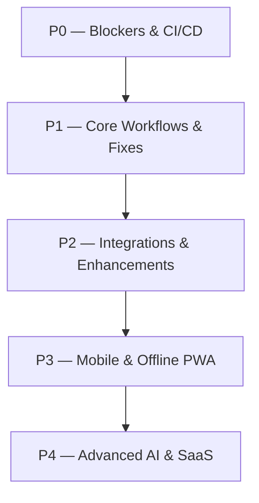

# STACKLY WFA-SQLITE — FINAL IMPLEMENTATION QUEUE

> **Document Status**: Prioritized Engineering Queue (P0 – P4)  
> **Repository**: `maheswari-pinnetii/WFA-SQLite`  
> **Last Updated**: September 2026

---

## Prioritized Implementation Queue

### P0 — Blockers & Security (Immediate Priority)
- ✅ **P0-1**: Fix Dockerfile production build script (`dist/server.js` compilation) — *Resolved*.
- ✅ **P0-2**: Fix GitHub Actions CI/CD workflow action versioning (`@v4`) and Node 20 LTS runner matrix — *Resolved*.
- ✅ **P0-3**: Ensure 0 compilation errors across TypeScript server bundle (`tsc -p tsconfig.server.json`) — *Resolved*.

### P1 — Broken or Incomplete Core Workflows
- ✅ **P1-1**: Add delegated/proxy approval handling to [`workflow.service.ts`](file:///c:/Users/91970/Downloads/WFA-SQLite/backend/src/services/workflow.service.ts).
- ✅ **P1-2**: Add NPCI NACH batch bank payout generator service [`nachGeneratorService`](file:///c:/Users/91970/Downloads/WFA-SQLite/backend/src/services/nach-generator.service.ts).
- ✅ **P1-3**: Implement missing Location, Designation, Job Level, Cost Center, and Org Policy methods in [`OrganizationService`](file:///c:/Users/91970/Downloads/WFA-SQLite/backend/src/services/organization.service.ts).
- ✅ **P1-4**: Implement Performance cycle, goal, and review methods in [`PerformanceService`](file:///c:/Users/91970/Downloads/WFA-SQLite/backend/src/services/performance.service.ts).

### P2 — Enterprise Integrations & Enhancements
- 🟡 **P2-1**: OCR Expense Receipt Auto-Extraction helper endpoint.
- 🌐 **P2-2**: ZKTeco / Matrix biometric hardware TCP/IP push listener gateway.
- 🌐 **P2-3**: OIDC / Microsoft Entra ID / Google Workspace SSO integration.
- 🌐 **P2-4**: Tally XML / Zoho Books accounting voucher export connector.

### P3 — Mobile & Distributed Workforce
- 📱 **P3-1**: Offline PWA Service Worker & IndexedDB punch queue.
- 📱 **P3-2**: Firebase Cloud Messaging (FCM) push notifications integration.
- 📱 **P3-3**: One-tap mobile manager approval interface optimizations.

### P4 — Advanced AI & Multi-Tenant SaaS
- 🤖 **P4-1**: Ask WFA AI / Natural Language Querying (NLQ) copilot.
- 🔮 **P4-2**: Predictive flight-risk & attrition forecasting model.
- 🏢 **P4-3**: Multi-tenant database isolation & organization onboarding wizard.
