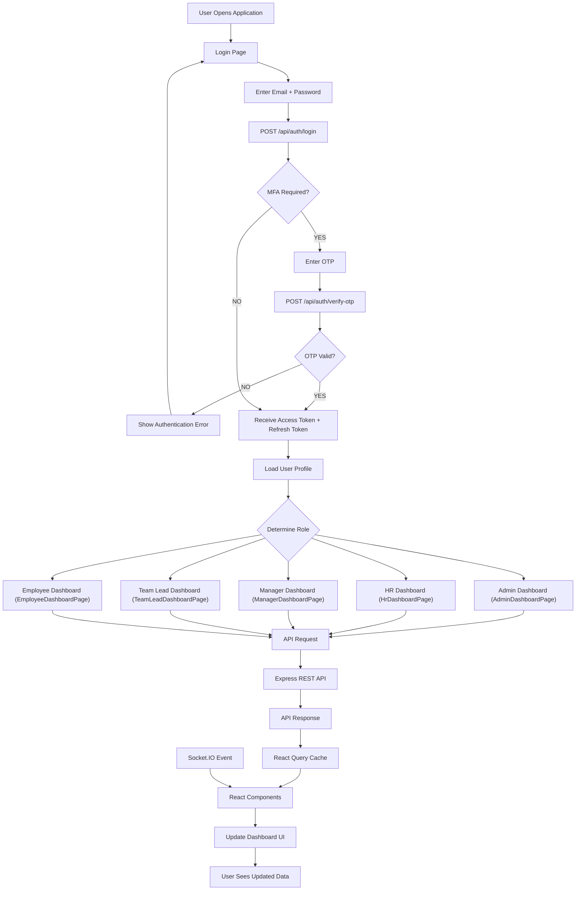

# 📊 Frontend Runtime Flowchart

This flowchart outlines the React application bootstrap process, route routing, authentication check, user dashboard routing based on role permissions, and how state updates trigger re-renders.

