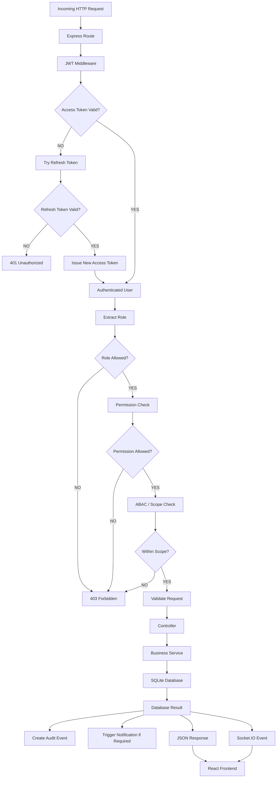

# ⚙️ Backend API Routing & Request Flowchart

This flowchart outlines the backend request flow: parsing headers, checking token validation, verifying role guards, evaluating ABAC and scoping permissions, executing handlers, database interaction, audit logs, and responding back.

