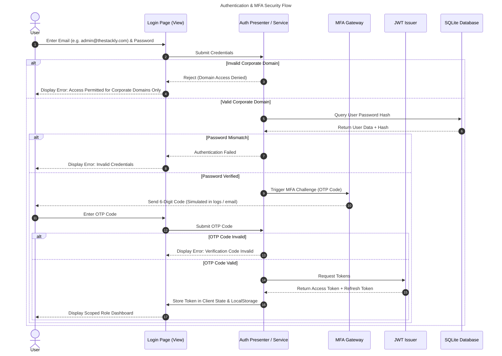

# 🔐 Authentication & MFA Sequence Flow

This sequence flowchart outlines the specific multi-step verification: login submission, domain verification, password hash matching, generating MFA/OTP challenges, user verification, and issuing session keys.

