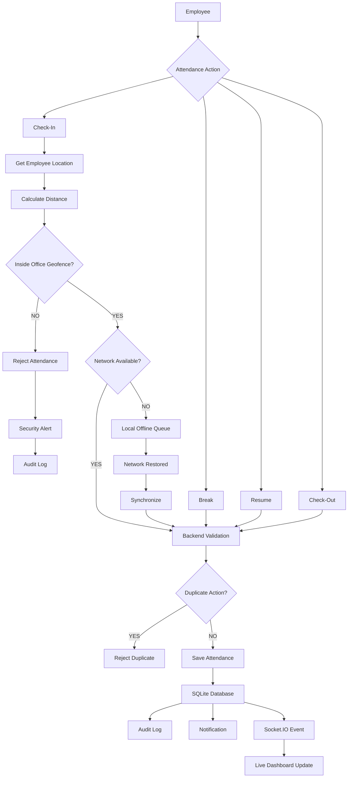

# ⏱️ Attendance Lifecycle, Offline Sync & Geofencing Flowchart

This flowchart outlines the attendance check-in, break, resume, check-out process, coordinate extraction, geofence check, offline persistence queue sync, idempotency validation, and UI updates.

