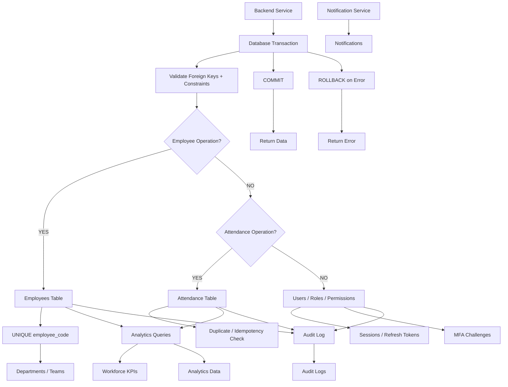

# 🗄️ Database Transaction & Data Scoping Flowchart

This flowchart demonstrates backend transaction sequences: schema constraint checks, entity updates, analytics query aggregation, index-driven lookups, transaction commits/rollbacks, and audit logging.

