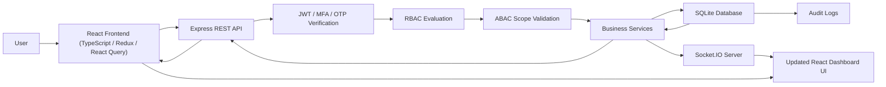

# 🔄 Complete End-to-End System Flowchart

This flowchart visualizes the complete end-to-end user-to-database-to-UI flow. It serves as a overview mapping out the request chain from the React UI down to SQLite Database, and Socket.io updating the dashboard UI.

---

### End-to-End Request Chain in One Sentence:
> **User** $\rightarrow$ **React UI** $\rightarrow$ **Protected Route** $\rightarrow$ **REST API** $\rightarrow$ **JWT/MFA** $\rightarrow$ **RBAC** $\rightarrow$ **ABAC/Scope** $\rightarrow$ **Controller** $\rightarrow$ **Service** $\rightarrow$ **SQLite Database** $\rightarrow$ **Audit/Notification** $\rightarrow$ **Socket.IO** $\rightarrow$ **React UI**.
