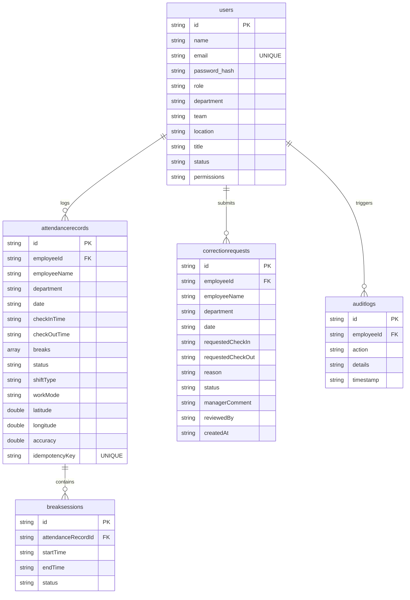

# Full-Stack System Architecture & Integration Model

This document outlines the full-stack system architecture of the Workforce Analytics Intelligence Platform, detail-routing the Frontend, Backend, and Database persistence layer integrations.

---

## 1. Directory Structural Separation

To guarantee a clean separation of concerns, the project is structured as follows:

```
wfa-rolebased-architecture/
├── frontend/               # React client SPA (formerly src/)
│   ├── components/         # Reusable presentation views & controls
├── frontend/           # Scoped dashboard modules (Admin, HR, etc.)
│   ├── services/           # Api client wrappers and background sync logic
│   └── store/              # Redux slices (auth, attendance, theme)
├── backend/                # Express.js REST API server
│   └── server.js           # Server routes, middlewares, and DB logic
├── database/               # Database documentation
├── tests/                  # Unified Test Suites
│   └── attendance.test.ts  # Mock & Service integration tests
└── package.json            # Unified dependencies and Concurrent run scripts
```

---

## 2. Frontend Architecture (React SPA)

- **Framework & Tooling**: Vite + React 18 + TypeScript.
- **State Management**: Redux Toolkit for unified global state (auth sessions, sidebar states, active check-in profiles).
- **Theme-Aware Charts**: Custom wrapped charts in `frontend/features/analytics/charts/` built on top of Recharts, utilizing the reusable `AnalyticsChartContainer` to handle Loading, Empty, and Error states cleanly.
- **API Client**: Axios instance (`frontend/services/api.ts`) configured with global interceptors that automatically:
  - Inject JWT bearer tokens on all outgoing requests.
  - Redirect to `/login` upon detecting expired session codes (HTTP 401).

---

## 3. Backend Architecture (Express API)

The backend is built as an Express.js server utilizing Node ES Modules:

- **Server Endpoint**: Listened on port `5000` (proxied by Vite dev server via `/api` requests).
- **Authentication**: JWT token validation using custom `authenticateToken` middleware.
- **Scoping & Access Boundaries**:
  - **Admin**: Grants full read/write privileges organization-wide.
  - **HR**: Grants access to directory listings and attendance logs.
  - **Managers / Team Leads**: Scopes query requests to match their department codes (`req.user.department`).
  - **Employee**: Scopes all database queries strictly to the active session user's ID (`req.user.id`).

---

## 4. Database Architecture (SQLite)

The persistence layer uses a SQLite database with the following table schema:



---

## 5. Frontend & Backend Connection (Proxy & Sync)

- **Proxy Routing**: Vite's server configuration maps client `/api` paths directly to `http://localhost:5000/api`.
- **Hybrid Offline-First Sync**:
  - Frontend operations (Check-In, Break, Check-Out) synchronously update the client-side `localStorage` cache immediately to prevent lagging and preserve full offline capabilities.
  - Concurrently, a background async fetch request is fired via `apiClient` to persist the action inside the SQLite database.
  - If a network error occurs, the action is enqueued inside an offline queue to be synchronized once connection is restored.
