# Stackly Workforce Analytics (WFA-SQLite) Architecture

## 1. Architecture Overview
The Stackly Workforce Analytics (WFA-SQLite) system is an enterprise-grade workforce management platform. It provides role-based access for Administrators, HR Personnel, Managers, Team Leads, and Employees to manage attendance, leave, performance, and organizational structures. The system follows a modern decoupled architecture with a React/TypeScript frontend and a Node.js/Express backend, utilizing SQLite as the authoritative persistence layer.

## 2. Architecture Goals
- **Security-First:** The backend is the authoritative security boundary. The frontend provides UX/access-control helpers, but all data access is strictly governed by backend RBAC and scope validation.
- **Role & Scope Aware:** The architecture intrinsically supports varying organizational scopes (Global, Department, Team, Self) based on predefined roles.
- **Resilience:** Defensive UI patterns (ErrorBoundaries, fallback UIs, safe local storage access) ensure that failures degrade gracefully rather than resulting in white screens.
- **Separation of Concerns:** Clear boundaries exist between Presentation, Application State, API Orchestration, Controllers, Domain Services, and Data Access.

## 3. Architecture Principles
- Frontend presents.
- Application orchestrates.
- API communicates.
- Security authorizes.
- Domain decides.
- Persistence stores.
- SQLite persists.
- Infrastructure deploys.

## 4. System Context
The WFA-SQLite system operates as a client-server application where end-users interact with a web-based React application. The frontend communicates exclusively via REST APIs with the Node.js backend. The backend manages all business logic, authorization, and data persistence with SQLite.

## 5. High-Level Architecture
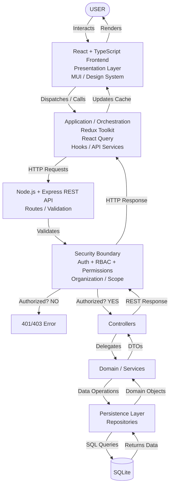

## 6. Architectural Layers
The architecture is divided into the following logical layers:
1. **Presentation (Frontend):** React components, MUI, Design System.
2. **Application Orchestration (Frontend):** Redux Toolkit, React Query, API hooks.
3. **API (Backend):** Express routers, validation middleware.
4. **Security (Backend):** Authentication and Authorization middleware, Scope validation.
5. **Domain (Backend):** Business logic services (Attendance, Leave, Organization, etc.).
6. **Persistence (Backend):** Repositories abstracting SQL operations.
7. **Database:** SQLite.

## 7. Frontend Architecture
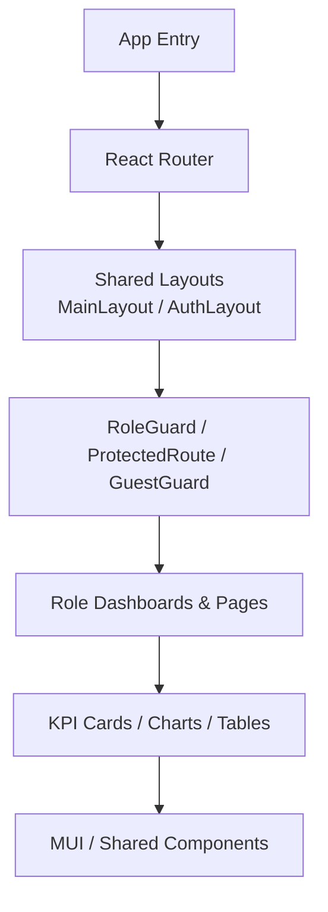

## 8. Application / State Orchestration
```mermaid
flowchart TD
    subgraph APPLICATION STATE
        ClientState[Client State\n(Redux / Context / useState)]
        ServerState[Server State\n(React Query)]
    end
    
    ClientState --> UI[UI / App Behavior]
    ServerState --> API[API / Cache]
```

## 9. API Architecture
The REST API serves as the communication boundary. It handles routing, request validation (e.g., Zod schemas), and delegates processing to controllers after security checks.

## 10. Security Architecture
Security is a cross-cutting concern enforced at the backend.
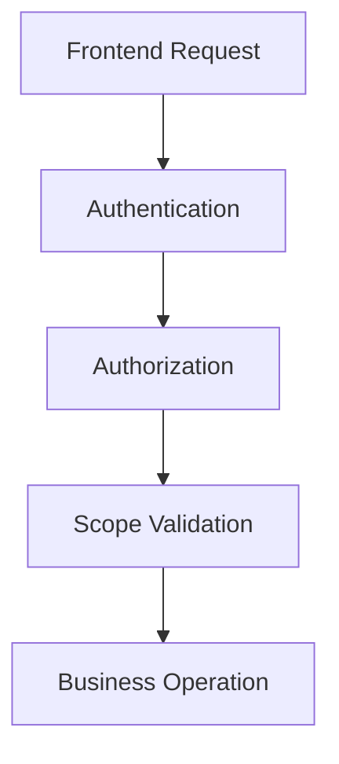

## 11. RBAC Architecture
Roles (`ADMIN`, `HR`, `MANAGER`, `TEAM_LEAD`, `EMPLOYEE`) define baseline access. Permissions (e.g., `SYSTEM_CONFIG`, `ATTENDANCE_VIEW_ALL`) define specific operational capabilities.

## 12. Scope Architecture
Data access is scoped by organizational boundaries. An employee views their own records; a manager views their department's records; an admin has global scope.

## 13. Domain Architecture
Business domains (Attendance, Leave, Employees, etc.) are encapsulated in Domain Services, ensuring UI and Controllers remain free of business rules.

## 14. Database Architecture
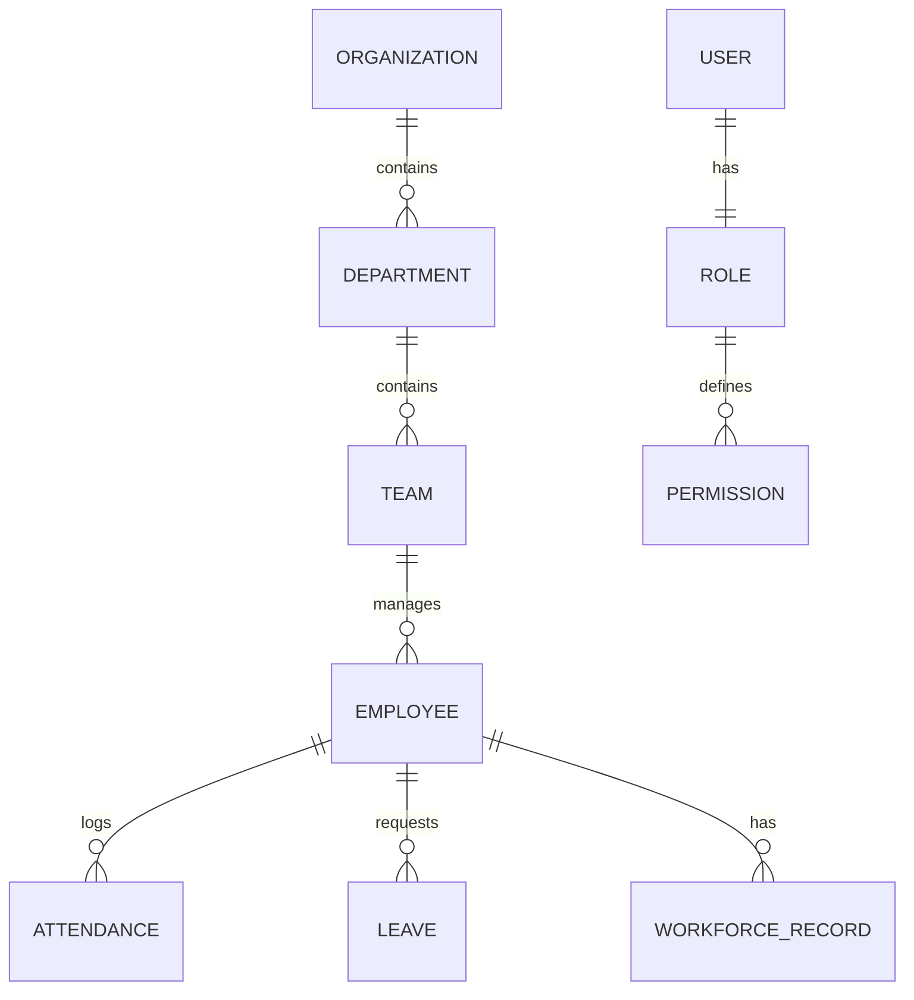

## 15. Dashboard Architecture
Dashboards are role-specific but share underlying components and data fetching patterns.
- **ADMIN Dashboard:** Organization scope.
- **HR Dashboard:** Organization / HR scope.
- **MANAGER Dashboard:** Department / managed teams scope.
- **TEAM_LEAD Dashboard:** Team scope.
- **EMPLOYEE Dashboard:** Self scope.

## 16. Authentication Flow
```mermaid
flowchart TD
    Start[User Opens Application] --> CheckSession{Valid Session\nin Storage?}
    CheckSession -->|YES| Restore[Restore User, Role, Permissions]
    Restore --> Ready[Application Ready]
    
    CheckSession -->|NO| Refresh[Attempt Silent Refresh]
    Refresh --> Success{Refresh\nSuccessful?}
    Success -->|YES| RestoreSession[Restore Session & Load User]
    RestoreSession --> Ready
    Success -->|NO| Unauth[Unauthenticated]
    Unauth --> LoginRoute[/login]

    LoginForm[Login Form] --> Creds[Enter Credentials]
    Creds --> Post[/api/v1/auth/login]
    Post --> Valid{Credentials Valid?}
    Valid -->|NO| AuthError[Authentication Error] --> LoginForm
    Valid -->|YES| Identity[Identify User & Role]
    Identity --> Session[Set Session Token]
    Session --> Dashboard[Redirect to Role Dashboard]
```

## 17. Authorization Flow
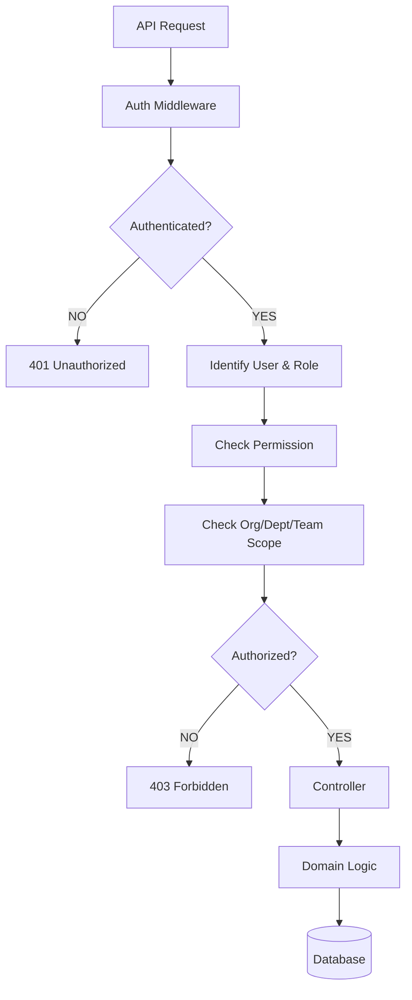

## 18. Routing Flow
```mermaid
flowchart TD
    Start[Application Start] --> Router[React Router]
    Router --> Public{Public Route?}
    Public -->|YES| RenderPub[Render Public Page]
    Public -->|NO| Protected[ProtectedRoute]
    Protected --> Loading{Auth Loading?}
    Loading -->|YES| LoadUI[Loading UI]
    Loading -->|NO| AuthCheck{Authenticated?}
    AuthCheck -->|NO| RedirectLogin[/login]
    AuthCheck -->|YES| RoleCheck[Check Role]
    
    RoleCheck --> Admin[ADMIN]
    RoleCheck --> HR[HR]
    RoleCheck --> Manager[MANAGER]
    RoleCheck --> TeamLead[TEAM_LEAD]
    RoleCheck --> Employee[EMPLOYEE]
    
    Admin --> AdminDash[Admin Dashboard]
    HR --> HRDash[HR Dashboard]
    Manager --> MgrDash[Manager Dashboard]
    TeamLead --> TLDash[Team Lead Dashboard]
    Employee --> EmpDash[Employee Dashboard]
    
    Router --> Unknown{Unknown Route?}
    Unknown -->|YES| 404[404 / Safe Fallback]
```

## 19. Dashboard Data Flow
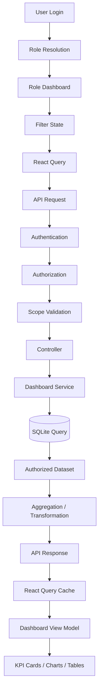

## 20. API Request Flow
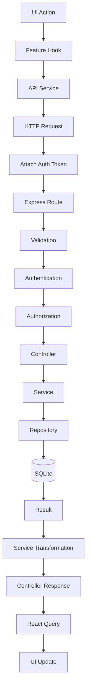

## 21. State Management Flow
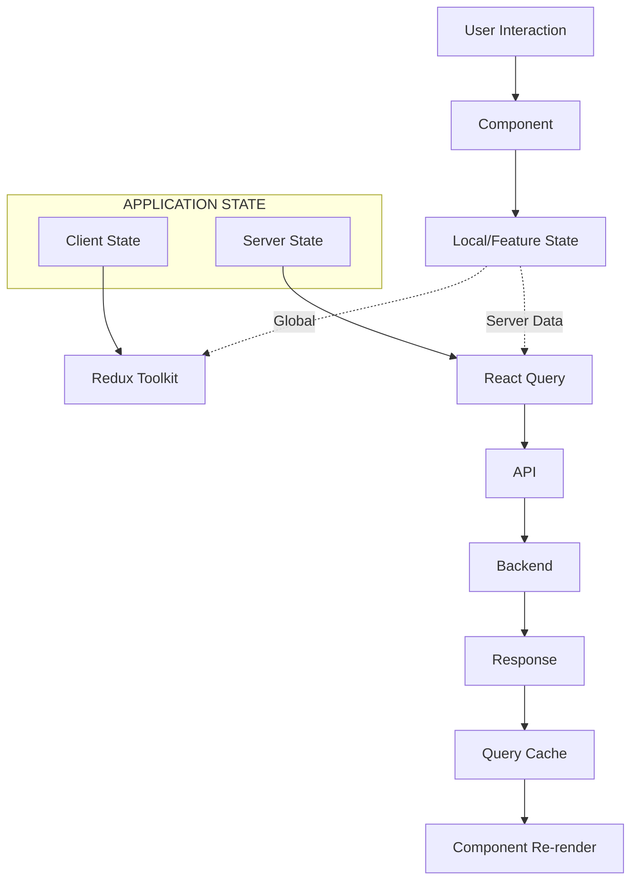

## 22. Attendance Flow
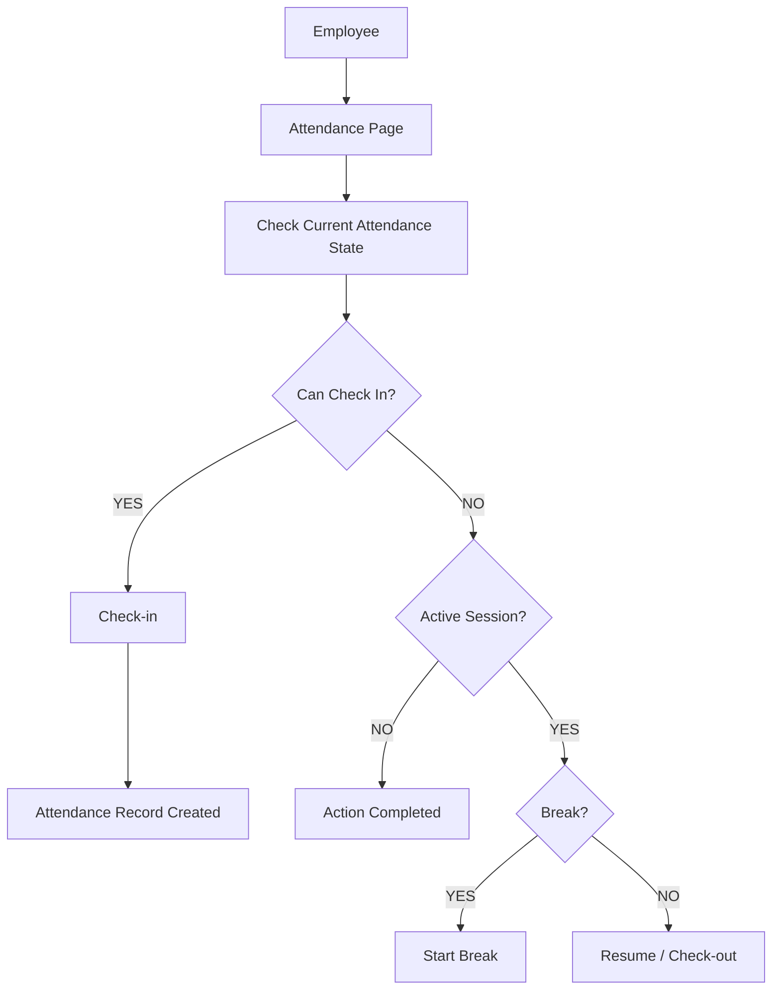

## 23. Leave Flow
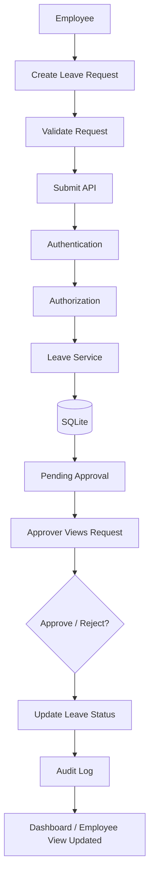

## 24. Error Handling Flow
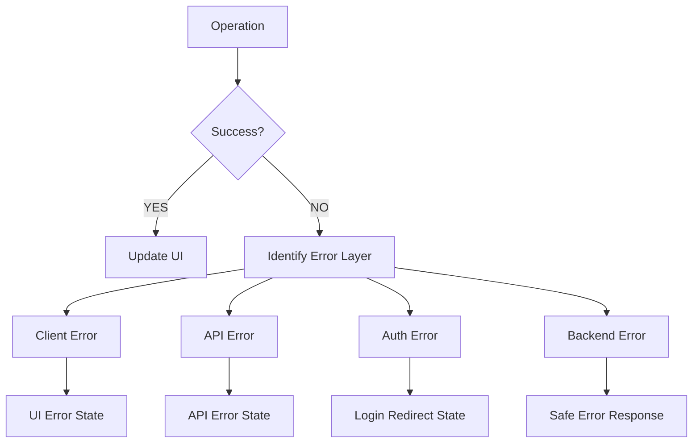

## 25. Real-Time Flow
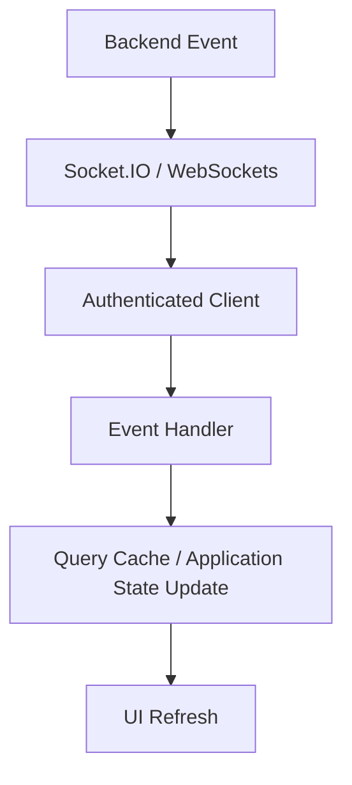
*(Note: Real-time functionality is indicated where implemented via the `sockets` directory in the backend).*

## 26. Testing Architecture
```mermaid
flowchart TD
    Code[Code Change] --> TS[TypeScript Check]
    TS --> Unit[Unit Tests (Vitest)]
    Unit --> Comp[Component Tests (React Testing Library)]
    Comp --> API[API / Integration Tests]
    API --> Sec[Security Tests]
    Sec --> E2E[Playwright E2E]
    E2E --> Build[Build]
    Build --> Docker[Docker]
    Docker --> CICD[CI/CD]
    CICD --> Deploy[Deployment]
```

## 27. Deployment Architecture
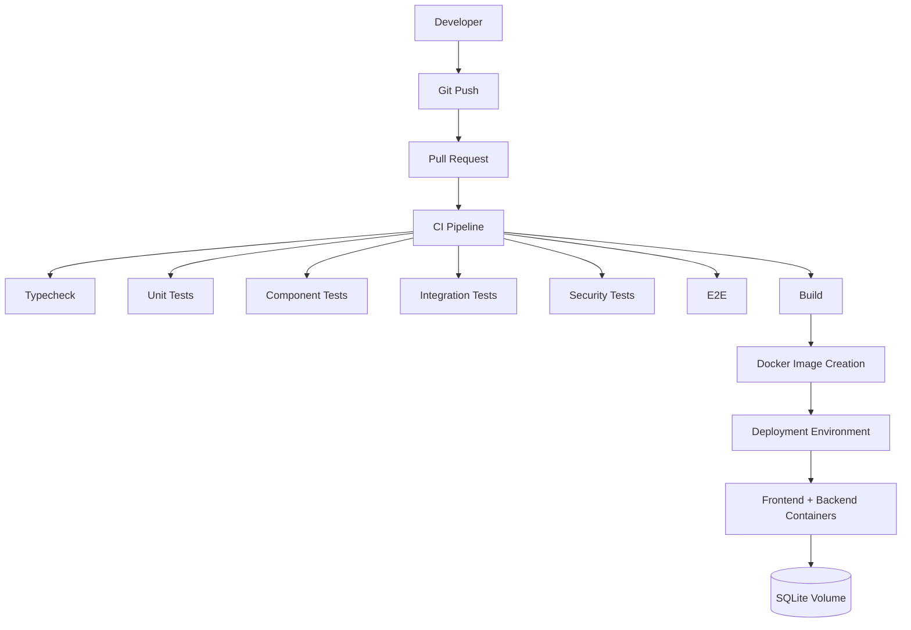

## 28. Repository Structure
The repository is divided primarily into:
- `frontend/`: React + Vite application.
- `backend/`: Node.js + Express REST API.
- `database/`: SQLite database files and migrations.

## 29. Module Responsibilities
See Section 29 in the Data Ownership and Component Mapping sections.

## 30. Dependency Direction
```text
Role Feature --> Shared Components --> Design System
Feature --> Application Hooks --> API Services
```

## 31. Data Ownership
| Data                    | Owner       | Frontend | Backend       | Database |
| ----------------------- | ----------- | -------- | ------------- | -------- |
| UI visibility           | Frontend    | Yes      | No            | No       |
| Modal state             | Frontend    | Yes      | No            | No       |
| Filters                 | Frontend    | Yes      | No            | No       |
| Query cache             | React Query | Yes      | No            | No       |
| Global client state     | Redux       | Yes      | No            | No       |
| Authentication decision | Backend     | Consume  | Authoritative | Persist  |
| Authorization           | Backend     | UX only  | Authoritative | Support  |
| Permissions             | Backend     | Consume  | Authoritative | Persist  |
| Scope                   | Backend     | Consume  | Authoritative | Persist  |
| Workforce records       | Backend     | Consume  | Process       | SQLite   |
| Attendance              | Backend     | Consume  | Process       | SQLite   |
| Leave                   | Backend     | Consume  | Process       | SQLite   |

## 32. Frontend vs Backend Responsibilities
Frontend: Presents UI, manages client state, routes pages, handles user interactions, orchestrates API calls.
Backend: Secures endpoints, validates inputs, enforces business rules, manages persistence, acts as authoritative source of truth.

## 33. Current vs Future Architecture
The current architecture heavily leverages SQLite for operational data storage. Future iterations may involve database migrations or scaling out WebSocket functionality for broader real-time features.

## 34. Architecture Risks
- Depending on frontend state for security decisions (Mitigated by strict Backend RBAC).
- SQLite concurrency limitations at very high scale (Mitigated by architecture enabling future DB migration if needed).

## 35. Architecture Decisions
- Centralized `MainLayout` and `AppProvider` to manage global states cleanly.
- Use of `GuestGuard`, `ProtectedRoute`, and `RoleGuard` for client-side routing.
- Deletion of `tailwind.config.js` in favor of Tailwind v4 CSS imports to prevent build conflicts.

## 36. Architecture Validation Checklist
- [x] React does not access SQLite directly
- [x] Backend is authoritative for security
- [x] Authentication exists
- [x] RBAC exists
- [x] Permission checks exist
- [x] Organization scope exists
- [x] Department scope exists
- [x] Team scope exists
- [x] Employee scope exists
- [x] Presentation is separated from orchestration
- [x] Redux is used for appropriate client state
- [x] React Query is used for server state
- [x] REST API is the frontend/backend boundary
- [x] Domain logic is separated from controllers
- [x] Persistence is separated from domain logic
- [x] SQLite is the operational source of truth
- [x] Dashboards consume governed data
- [x] Loading states exist
- [x] Empty states exist
- [x] Error states exist
- [x] ErrorBoundary exists
- [x] Authentication flow is documented
- [x] Authorization flow is documented
- [x] Dashboard flow is documented
- [x] Attendance flow is documented
- [x] Leave flow is documented
- [x] API flow is documented
- [x] State flow is documented
- [x] Testing flow is documented
- [x] Deployment flow is documented
- [x] Current and future architecture are distinguished
- [x] Actual repository paths are verified
- [x] No fictional modules are introduced

## 37. Complete End-to-End Flow
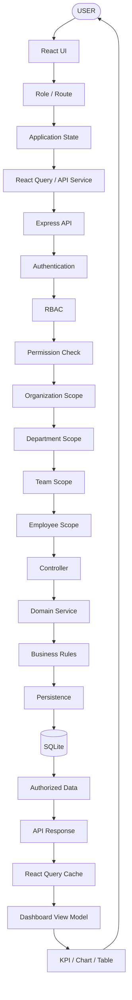

## 38. Module Mapping

| Layer        | Module          | Responsibility             | Technology    | Actual Path       |
| ------------ | --------------- | -------------------------- | ------------- | ----------------- |
| Presentation | Dashboard       | Dashboard UI               | React/MUI     | `frontend/src/features/*/dashboard/*` |
| Application  | Query Hook      | Server-state orchestration | React Query   | `frontend/src/hooks/` |
| State        | Global State    | Client state               | Redux Toolkit | `frontend/src/app/store.ts` |
| API          | Route           | HTTP boundary              | Express       | `backend/src/routes/` |
| Security     | Auth Middleware | Authentication             | Express       | `backend/src/middleware/auth.middleware.ts` |
| Security     | RBAC            | Authorization              | Backend       | `backend/src/middleware/rbac.middleware.ts` |
| Domain       | Attendance      | Attendance rules           | Node/TS       | `backend/src/services/attendance.service.ts` |
| Persistence  | Repository      | SQLite access              | SQLite        | `backend/src/repositories/` |
| Data         | Database        | Operational storage        | SQLite        | `database/` |

## 39. Boundary Diagram
```text
┌──────────────── FRONTEND ────────────────┐
│ Presentation                             │
│ Application / State / API orchestration  │
└───────────────────┬──────────────────────┘
                    │ REST
════════════════════╪════════════════════════
                    │
┌───────────────────▼──────────────────────┐
│ BACKEND                                  │
│ API                                      │
│ Security                                 │
│ Domain / Business Logic                  │
│ Persistence                              │
└───────────────────┬──────────────────────┘
                    │
                    ▼
                 SQLite
```
