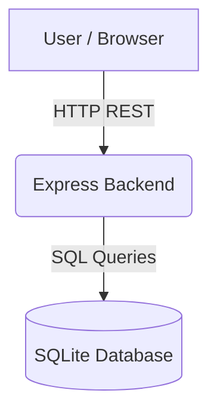

# How The System Works

This document explains the end-to-end functionality of the WFA-SQLite platform in simple but technically accurate language. The goal is to provide a comprehensive understanding of how the system processes a user's action from the browser down to the disk and back.

---

## 1. The Big Picture

At its core, WFA-SQLite is a monolithic Express.js backend paired with a React Single-Page Application (SPA) frontend. It uses a single-node SQLite database operating in Write-Ahead Log (WAL) mode for maximum concurrency and performance.



## 2. End-to-End Action: Checking In

Let's trace exactly what happens when a user clicks the **"Check In"** button on their dashboard.

### 2.1 The Browser (React Frontend)
1. **User Action**: The employee clicks the **Check In** button.
2. **React Event Handler**: The `onClick` handler in the UI component fires.
3. **API Client**: The application uses `fetch` (via custom wrappers or TanStack Query) to send a `POST /v1/attendance/check-in` request to the backend.
4. **Authentication**: The browser automatically includes the `HttpOnly` JWT cookie in the request headers.

```text
User clicks Check In
        ↓
React event handler
        ↓
API Client (fetch/React Query)
        ↓
Authentication JWT Cookie attached
```

### 2.2 The Backend (Express.js)
1. **Request ID Injection**: The `resilience.ts` middleware intercepts the request and injects a unique `x-request-id` into the headers.
2. **Rate Limiter**: The request passes through `express-rate-limit` to ensure the user isn't spamming the server.
3. **Authentication Guard (`auth.ts`)**: The JWT is decoded and verified. The user's ID and Role are extracted and attached to the request object (`req.user`).
4. **RBAC Guard (`roleGuard.ts`)**: The system confirms the user has the required permission (e.g., `EMPLOYEE` or higher) to hit the attendance route.
5. **Route Definition**: Express routes the request to the `attendanceController.ts`.

```text
Express Request ID Middleware
        ↓
Rate Limiter
        ↓
Authentication Guard (JWT)
        ↓
RBAC Guard
        ↓
Attendance Controller
```

### 2.3 The Business Logic & Database
1. **Controller**: Validates the geofencing coordinates (latitude/longitude) sent in the request body. If invalid, throws a 400 Bad Request. If valid, calls `attendanceService.checkIn(userId, coordinates)`.
2. **Service**: Contains the core business logic. It checks if the user is already checked in today. If they are, it throws a 409 Conflict. Otherwise, it prepares the data and calls `attendanceRepository.createPunch(...)`.
3. **Repository**: Constructs the raw SQL `INSERT INTO attendancerecords ...` query.
4. **Database Execution**: The query is executed. Because SQLite is in **WAL Mode**, the insert is written extremely fast to the `.wal` file, bypassing standard table locks and allowing other users to read their dashboards simultaneously.
5. **Transaction Commit**: The database confirms the write.

```text
Attendance Controller (Input Validation)
        ↓
Attendance Service (Business Rules)
        ↓
Attendance Repository (SQL Generation)
        ↓
SQLite Execution (WAL Mode)
        ↓
Database Result
```

### 2.4 The Response & UI Update
1. **Response Formatting**: The Service returns the new attendance record object to the Controller. The Controller wraps it in a standardized JSON payload and sends an `HTTP 201 Created` response back to the client.
2. **React Query Update**: The frontend receives the 201 response. React Query invalidates the cached "Today's Attendance" data, triggering a silent background refetch.
3. **State & UI Update**: The new data flows into the React components. The "Check In" button turns green and switches to "Check Out", and the live timer begins ticking on the dashboard.

```text
Express Response (HTTP 201)
        ↓
Browser receives JSON
        ↓
React Query invalidates cache
        ↓
React re-renders components
        ↓
Dashboard shows "Checked In" status
```

---

## 3. Summary of the Flow

1. **Browser**: Handles UI state and fires HTTP requests.
2. **Middleware**: Secures the request (Auth, RBAC, Rate Limiting).
3. **Controller**: Validates input shapes.
4. **Service**: Enforces business rules (e.g., "Cannot check in twice").
5. **Repository**: Translates code to SQL.
6. **SQLite**: Persists data safely to disk.
7. **Response**: Cycles back up the chain to update the UI.
