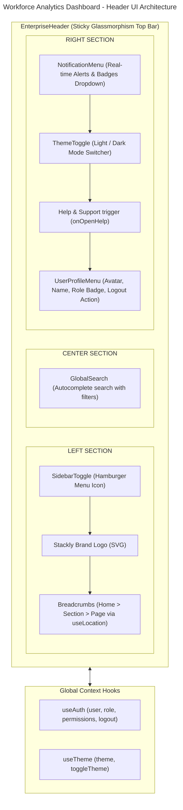
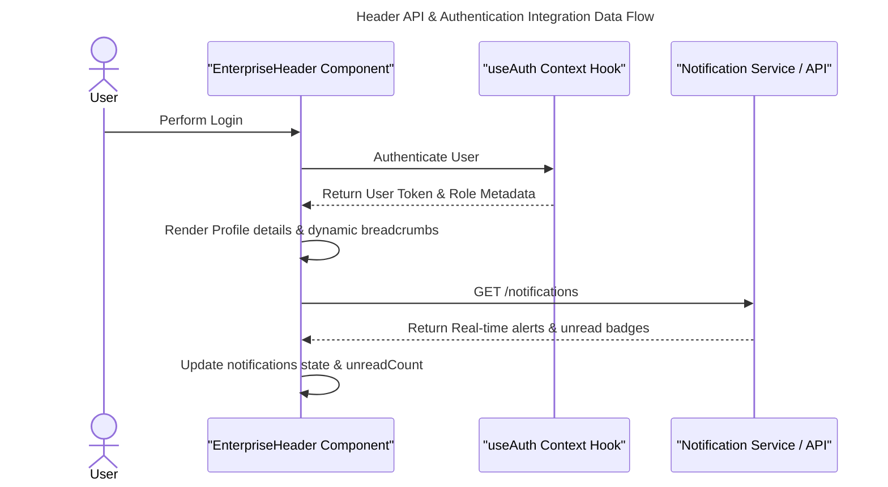

# Workforce Analytics Dashboard - Header Architecture

This document presents the enterprise responsive header navigation architecture, local and global state models, RBAC header behaviors, API integration flows, and component structure for the **Workforce Analytics Dashboard**.

---

## 1. Header UI Architecture Diagram



---

## 2. React Component Architecture

The header is implemented as a cohesive, high-performance module located at:

* **Header File**: [`EnterpriseHeader.tsx`](file:///c:/Users/91970/Documents/WFA-SQLITE-Frontend-project/frontend/src/shared/layouts/components/EnterpriseHeader.tsx)

It is integrated into the master frame layout:
* **Layout File**: [`MainLayout.tsx`](file:///c:/Users/91970/Documents/WFA-SQLITE-Frontend-project/frontend/src/shared/layouts/MainLayout.tsx)

---

## 3. Component State Model & Context Hooks

Rather than using complex global Redux reducers for simple UI headers, `EnterpriseHeader` combines lightweight **React local state** with **Global React Contexts**:

### Global Contexts
* **`useAuth()`**: Supplies authenticated `user`, current `role`, array of `permissions`, and `logout()` controller actions.
* **`useTheme()`**: Supplies current design system `theme` (`light` | `dark`) and `toggleTheme()` switcher function.

### Local State Hooks
```typescript
// Search states
const [searchQuery, setSearchQuery] = useState<string>('');
const [searchFocused, setSearchFocused] = useState<boolean>(false);
const [searchCategory, setSearchCategory] = useState<'all' | 'employees' | 'departments' | 'reports' | 'security'>('all');

// Notifications states
const [unreadCount, setUnreadCount] = useState<number>(3);
const [notifications, setNotifications] = useState<HeaderNotification[]>([]);

// Dropdown navigation state
const [activeDropdown, setActiveDropdown] = useState<'profile' | 'role' | 'notif' | 'messages' | null>(null);

// Scope previews & Modals
const [showPermissionsPreview, setShowPermissionsPreview] = useState<boolean>(false);
const [showLogoutModal, setShowLogoutModal] = useState<boolean>(false);
```

---

## 4. API & Authentication Flow



---

## 5. RBAC & Permission-Based Header Behavior

The header uses roles dynamically extracted from `useAuth()` to adjust visible regions and labels:

* **ADMIN HEADER**: Renders the system administrator role badge, exposes full audit stream navigation, and allows checking security permissions scopes via the profile dropdown.
* **HR MANAGER HEADER**: Renders HR specialist tags, features human capital indicators, and prioritizes HR-specific alerts (e.g. late check-ins, employee profile verification).
* **DEPARTMENT MANAGER / TEAM LEAD HEADER**: Renders executive management role badges, displays team-centric approvals alerts, and highlights management links in search suggestions.
* **EMPLOYEE HEADER**: Displays employee self-service details, personal profile settings, and standard employee notification streams.

---

## 6. Layout Spacing Specifications

```text
-----------------------------------------------------------------------------
| SidebarToggle | Logo | Breadcrumbs | Global Search (Ctrl + K) | Actions | Profile |
-----------------------------------------------------------------------------
|               |                                                           |
|  Sidebar      |                   Dashboard Content Area                  |
|  Navigation   |                                                           |
-----------------------------------------------------------------------------
```
- **Height**: Fixed at `4rem` (`64px`) to perfectly line up with the sidebar content spacing.
- **Glassmorphism**: `backdrop-blur-md` with `border-b border-slate-200/80` (Light Mode) and `border-slate-800/80` (Dark Mode).
- **Z-Index Layer**: Hardened at `z-index: 40` to hover cleanly above scrollable page views while staying below interactive modal overlays.
