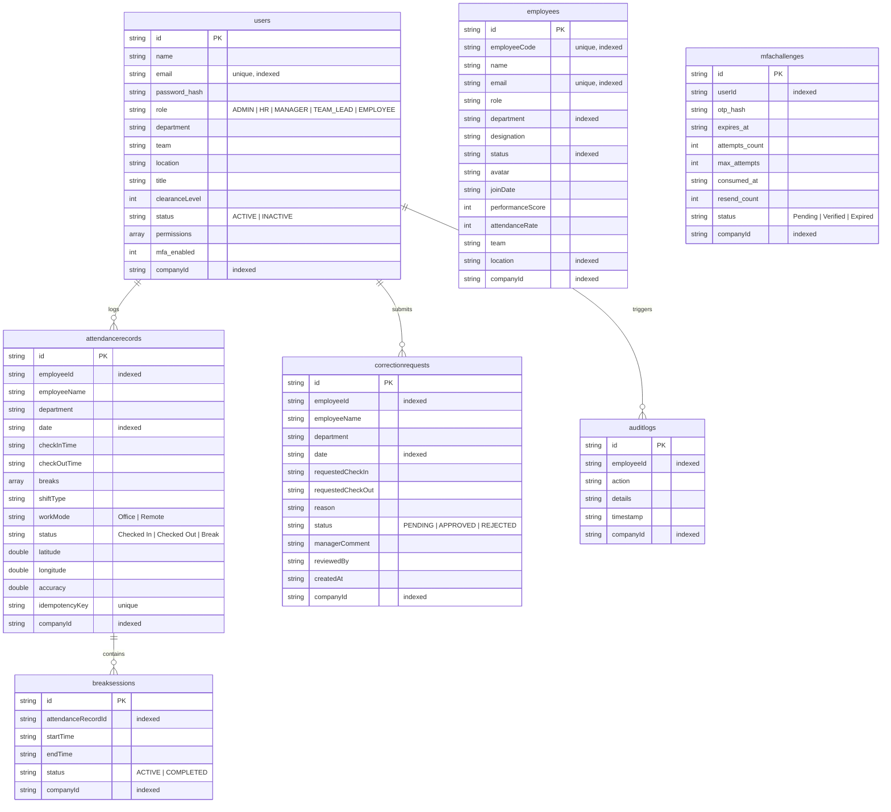

<!-- Content from architecture/04-database-architecture.md -->

# 🗄️ Database Architecture

This document describes the SQLite database tables, schema structure, relationships, indexes, and columns in the Workforce Analytics system.

The database uses SQLite (local file database during development, and SQLite Cloud for production persistence), utilizing relational constraints, foreign keys, and indexes.

## 1. Database Tables Overview

## 2. Tables and Indexes

### Users Table (`users`)
- **Key Fields**: `id`, `email`, `password_hash`, `role`, `companyId`.
- **Indexes**:
  - `id`: Unique index for internal lookup references.
  - `email`: Unique index for authentication queries.
  - `companyId`: Index for multi-tenant isolation query scoping.

### Employees Table (`employees`)
- **Key Fields**: `id`, `employeeCode`, `name`, `email`, `department`, `location`, `companyId`.
- **Indexes**:
  - `id`: Unique lookup index.
  - `employeeCode`: Unique identifier index.
  - `email`: Unique email index.
  - `department`: Scoped queries for department filters.
  - `location`: Queries filtering employees by office branch.

### Attendance Table (`attendancerecords`)
- **Key Fields**: `id`, `employeeId`, `date`, `status`, `idempotencyKey`.
- **Indexes**:
  - `employeeId` + `date`: Compound index for daily logs lookup.
  - `idempotencyKey`: Unique index to prevent duplicate check-in API processing.

### Correction Requests Table (`correctionrequests`)
- **Key Fields**: `id`, `employeeId`, `date`, `status`.
- **Indexes**:
  - `employeeId`: Speeds up retrieval of individual submission logs.
  - `status`: Index to quickly locate pending approvals for managers.

<!-- Content from architecture/DATABASE-DESIGN-PATTERNS.md -->

# Database Design & System Architecture Patterns Inventory

This document details the complete design pattern suite, BaaS API architecture mapping, and UI design system components implemented in the **Stackly Workforce Analytics Platform**.

---

## 🏛️ Part 1: System Design & Database Design Patterns (18 Total)

| Pattern | Status | Implementation Evidence & Code Location |
|---|---|---|
| **Sharding** | Implemented | [sharding.ts](file:///c:/Users/91970/Downloads/WFA-SQLite/backend/src/patterns/sharding.ts): `ShardRouter` hashes sharding keys to virtual shard database nodes (`shard-0`, `shard-1`, `shard-2`). |
| **Replication** | Implemented | [replication.ts](file:///c:/Users/91970/Downloads/WFA-SQLite/backend/src/patterns/replication.ts): `ReplicationManager` tracks WAL leader-follower sync status and replication lag. |
| **CQRS** | Implemented | [cqrs.ts](file:///c:/Users/91970/Downloads/WFA-SQLite/backend/src/patterns/cqrs.ts): Command mutations (`PUNCH_ATTENDANCE`) emitting `attendance_events` vs Query read model aggregations (`GET_DASHBOARD_SUMMARY`). |
| **Event Sourcing** | Implemented | [eventSourcing.ts](file:///c:/Users/91970/Downloads/WFA-SQLite/backend/src/patterns/eventSourcing.ts): `EventSourcingEngine` stores immutable event streams and reconstructs aggregate state (`rebuildState`). |
| **Database per Service** | Implemented | [databasePerService.ts](file:///c:/Users/91970/Downloads/WFA-SQLite/backend/src/patterns/databasePerService.ts): `DatabasePerServiceManager` isolates bounded context schemas (Auth, Employee, Attendance, Payroll DBs). |
| **Saga Pattern** | Implemented | [saga.ts](file:///c:/Users/91970/Downloads/WFA-SQLite/backend/src/patterns/saga.ts): `SagaOrchestrator` executes multi-step workflows with compensating rollback actions on failure. |
| **Materialized View** | Implemented | [materializedView.ts](file:///c:/Users/91970/Downloads/WFA-SQLite/backend/src/patterns/materializedView.ts) & `connection.ts`: `dashboard_summary_mv` precomputes total employee counts, updated via database triggers. |
| **Read Replica** | Implemented | [readReplica.ts](file:///c:/Users/91970/Downloads/WFA-SQLite/backend/src/patterns/readReplica.ts): `ReadReplicaRouter` routes `SELECT` queries to read replicas and `INSERT`/`UPDATE` to primary master. |
| **Write-Ahead Log (WAL)** | Implemented | [writeAheadLog.ts](file:///c:/Users/91970/Downloads/WFA-SQLite/backend/src/patterns/writeAheadLog.ts): `journal_mode = WAL`, 10000ms busy timeout, and passive WAL checkpoint management. |
| **Indexing** | Implemented | [indexing.ts](file:///c:/Users/91970/Downloads/WFA-SQLite/backend/src/patterns/indexing.ts): B-Tree compound indexes (`idx_attendance_emp_date`, `idx_audit_logs_timestamp`) with runtime Index Advisor. |
| **Denormalization** | Implemented | [denormalization.ts](file:///c:/Users/91970/Downloads/WFA-SQLite/backend/src/patterns/denormalization.ts): Controlled denormalization duplicating employee name/department in log records for O(1) reads. |
| **Partitioning** | Implemented | [partitioning.ts](file:///c:/Users/91970/Downloads/WFA-SQLite/backend/src/patterns/partitioning.ts): `PartitionManager` routes date-range queries to partitioned table stores (`attendance_2026_08`, `attendance_2026_09`). |
| **Cache-Aside** | Implemented | [cacheAside.ts](file:///c:/Users/91970/Downloads/WFA-SQLite/backend/src/patterns/cacheAside.ts) & `cache.service.ts`: Application-level caching layer with lazy loading, TTL expiry, and stats. |
| **Star Schema** | Implemented | [starSchema.ts](file:///c:/Users/91970/Downloads/WFA-SQLite/backend/src/patterns/starSchema.ts): Dimensional OLAP warehouse model separating `FactAttendanceDaily` from `DimDate`, `DimEmployee`, and `DimDepartment`. |
| **Polyglot Persistence** | Implemented | [polyglotPersistence.ts](file:///c:/Users/91970/Downloads/WFA-SQLite/backend/src/patterns/polyglotPersistence.ts): Unified store manager combining Relational SQL, In-Memory KV Cache, and Append-Only Event Log. |
| **Bloom Filter** | Implemented | [bloomFilter.ts](file:///c:/Users/91970/Downloads/WFA-SQLite/backend/src/patterns/bloomFilter.ts): Probabilistic bitset structure returning 100% negative confidence for employee lookups. |
| **Consistent Hashing** | Implemented | [consistentHashing.ts](file:///c:/Users/91970/Downloads/WFA-SQLite/backend/src/patterns/consistentHashing.ts): `ConsistentHashRing` with virtual nodes for dynamic node placement and minimal migration. |
| **Two-Phase Commit (2PC)** | Implemented | [twoPhaseCommit.ts](file:///c:/Users/91970/Downloads/WFA-SQLite/backend/src/patterns/twoPhaseCommit.ts): `TwoPhaseCommitCoordinator` managing Prepare and Commit/Abort phases across distributed database resources. |

---

## ⚡ Part 2: Modern BaaS APIs Replacing Backend Features

| SaaS / BaaS API | Custom Backend Feature Replaced | How It Replaces Custom Backend Code | Platform Blueprint |
| :--- | :--- | :--- | :--- |
| **Clerk** | Auth, Passkeys, TOTP, RBAC | Replaces custom Argon2id hashing, WebAuthn servers, JWT session cookies, and permission middleware. | Implemented in [baasServices.ts](file:///c:/Users/91970/Downloads/WFA-SQLite/backend/src/patterns/baasServices.ts) |
| **Uploadthing** | File Uploads, S3 Buckets, Storage | Replaces custom Multer upload endpoints, S3 presigned URL generators, and local file storage logic. | Implemented in [baasServices.ts](file:///c:/Users/91970/Downloads/WFA-SQLite/backend/src/patterns/baasServices.ts) |
| **Resend** | Transactional Emails & OTPs | Replaces custom Nodemailer SMTP servers and outbound email queue infrastructure. | Implemented in [baasServices.ts](file:///c:/Users/91970/Downloads/WFA-SQLite/backend/src/patterns/baasServices.ts) |
| **Supabase** | Relational DB, Auth, Real-Time | Replaces manual REST CRUD boilerplate and custom WebSocket servers with Postgres + RLS. | Implemented in [baasServices.ts](file:///c:/Users/91970/Downloads/WFA-SQLite/backend/src/patterns/baasServices.ts) |
| **Trigger.dev** | Async Jobs, Cron Schedules, Queues | Replaces BullMQ/Redis worker threads and node-cron for heavy HR payroll and audit tasks. | Implemented in [baasServices.ts](file:///c:/Users/91970/Downloads/WFA-SQLite/backend/src/patterns/baasServices.ts) |

---

## 🎨 Part 3: UI Design System Terms & Components (10 Total)

| UI Term / Element | Component Location & Implementation | Description |
| :--- | :--- | :--- |
| **1. Cards** | [card.tsx](file:///c:/Users/91970/Downloads/WFA-SQLite/frontend/src/components/ui/card.tsx), `EmailLoginCard.tsx`, `KPICard.tsx` | High-conversion card primitives for KPIs, forms, and marketing features. |
| **2. Sidebar** | `Sidebar.tsx`, `UserProfile.tsx` | Slide-out navigation drawer and sticky quick-nav bar. |
| **3. Widgets** | `LiveCheckInWidget.tsx`, `AnalyticsWidget.tsx` | Real-time geofenced clock-in widget and HUD radar scanner. |
| **4. Popover** | [UIComponentShowcase.tsx](file:///c:/Users/91970/Downloads/WFA-SQLite/frontend/src/components/ui/UIComponentShowcase.tsx) | Tooltips, contextual dropdown menus, and popover overlays. |
| **5. ToggleSwitch** | [switch.tsx](file:///c:/Users/91970/Downloads/WFA-SQLite/frontend/src/components/ui/switch.tsx) | Accessible toggle switches for dark mode, feature flags, and password masking. |
| **6. Text Fields** | [input.tsx](file:///c:/Users/91970/Downloads/WFA-SQLite/frontend/src/components/ui/input.tsx) | Text fields with overlaid labels for corporate emails and employee IDs. |
| **7. Modal** | [dialog.tsx](file:///c:/Users/91970/Downloads/WFA-SQLite/frontend/src/components/ui/dialog.tsx), `LogoutModal.tsx` | Modal dialogs for shift swap, punch corrections, and kudos replies. |
| **8. Accordion** | `LandingPage.tsx` Collapsible FAQs | Interactive accordion answering enterprise concurrency and geofencing FAQs. |
| **9. Badge** | [badge.tsx](file:///c:/Users/91970/Downloads/WFA-SQLite/frontend/src/components/ui/badge.tsx), `StatusBadge.tsx` | Visual pill badges for RBAC roles (`ADMIN`, `HR`), clearance levels, and task priorities. |
| **10. Progress Bar** | [UIComponentShowcase.tsx](file:///c:/Users/91970/Downloads/WFA-SQLite/frontend/src/components/ui/UIComponentShowcase.tsx) | PTO entitlement progress bars, 40h weekly goal meter, and calculation loaders. |