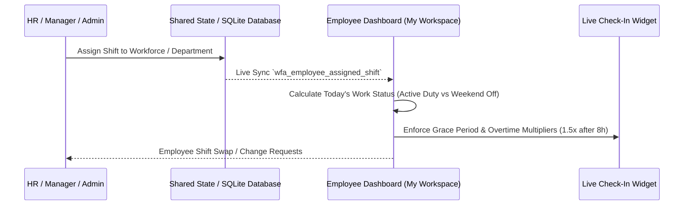

# Stackly Workforce: Shifts & Absence Management Technical Guide

This document outlines the architecture, rules, and synchronization workflows for **Shift Scheduling** and **Absence / Leave Management** in the Stackly Workforce Analytics Platform.

---

## 1. Shift Scheduling Architecture

### 1.1 Standard Shift Equation
$$\mathbf{\text{Total Shift Duration (9 Hours)}} = \mathbf{\text{Required Active Work (8 Hours)}} + \mathbf{\text{Statutory Break (1 Hour / 60 Mins)}}$$

### 1.2 Registered Corporate Shifts
1. **General Day Shift (`GS`)**:
   - **Timings**: `09:00 AM – 06:00 PM`
   - **Active Work Hours**: 8.0 Hours
   - **Break Allowance**: 1.0 Hour (Flexible lunch 13:00–14:00)
   - **Grace Window**: 15 Minutes (Late punch registered after 09:15 AM)
   - **Working Pattern**: Monday – Friday (5 Days / 40h standard)
   - **Assigned Departments**: Engineering, Product Management, Marketing, Operations

2. **Morning Support Shift (`MS`)**:
   - **Timings**: `07:00 AM – 04:00 PM`
   - **Active Work Hours**: 8.0 Hours
   - **Break Allowance**: 1.0 Hour
   - **Grace Window**: 15 Minutes (Late punch after 07:15 AM)
   - **Assigned Departments**: Tier-1 Customer Support, Cloud Incident Monitoring

3. **US / Night Business Shift (`NS`)**:
   - **Timings**: `06:30 PM – 03:30 AM`
   - **Active Work Hours**: 8.0 Hours
   - **Break Allowance**: 1.0 Hour
   - **Grace Window**: 15 Minutes (Late punch after 06:45 PM)
   - **Assigned Departments**: Global Sales, North America Infrastructure

---

## 2. Dynamic Shift Synchronization Flow

---

## 3. Absence & Leave Management Engine

### 3.1 Statutory Leave Quotas (CY 2026)
- **Casual Leave (CL)**: 12 Days (Unplanned personal events)
- **Sick Leave (SL)**: 12 Days (Medical illnesses; proof required after 2 consecutive days)
- **Earned Leave (EL)**: 18 Days (Planned vacations; carryover limit of 15 days)
- **Compensatory Off (Comp-Off)**: Earned credits for weekend or off-hour deployments
- **Maternity Leave**: 180 Days (Paid parental leave)
- **Paternity Leave**: 15 Days (Paid leave for new fathers)
- **Leave Without Pay (LWP)**: 30 Days (Unpaid leave after quota depletion)
- **Bereavement Leave**: 5 Days (Compassionate leave)

### 3.2 Public Holidays (CY 2026)
- **Jan 01, 2026**: New Year's Day (Thursday)
- **Jan 26, 2026**: Republic Day (Monday)
- **Mar 25, 2026**: Holi Festival of Colors (Wednesday)
- **May 01, 2026**: International Labor Day (Friday)
- **Aug 15, 2026**: Independence Day (Saturday)
- **Oct 02, 2026**: Gandhi Jayanti (Friday)
- **Oct 20, 2026**: Dussehra / Vijayadashami (Tuesday)
- **Nov 08, 2026**: Diwali / Festival of Lights (Sunday)
- **Dec 25, 2026**: Christmas Day (Friday)
- **Jan 01, 2027**: New Year's Day (Friday)

---

## 4. Developer & Maintenance Guidelines

- **Types & Constants**: All shift interfaces and default constant collections must reside in `frontend/src/shared/types/shifts.types.ts` to maintain Vite Fast Refresh consistency.
- **Component Separation**: React page components must avoid non-component top-level exports.
- **Verification**: Run `npm test` and `npm run build` after altering schedule or holiday models.
