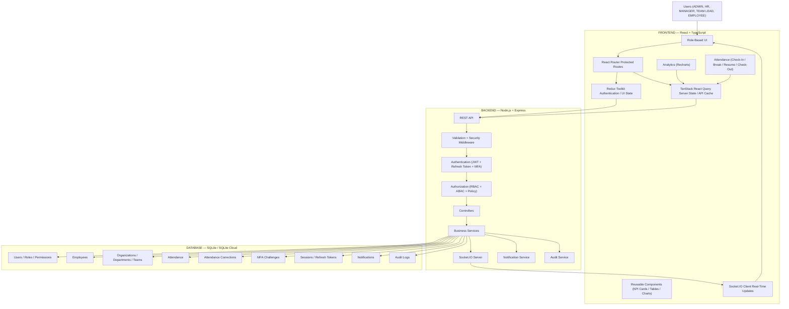

# 🌐 Overall Full-Stack System Architecture

This diagram illustrates the overall system architecture of the Workforce Analytics Platform, depicting the separation from the presentation views down to backend routing, security middleware, services, and the SQLite persistence layer.

---

### Core Architecture Description
1. **Presentation Layer (Frontend)**: Structured as a React SPA with Vite, routing handles role guards and permission checks. TanStack React Query handles network states while Redux manages local state (e.g. active check-in profiles, auth, sidebar).
2. **API & Security (Backend)**: Express API routes requests through authentication (JWT validation) and authorization (RBAC and DBAC checking) middleware.
3. **Database (SQLite)**: Persists relational tables with strict schemas, relational foreign key constraints, and query optimization via indexes.
