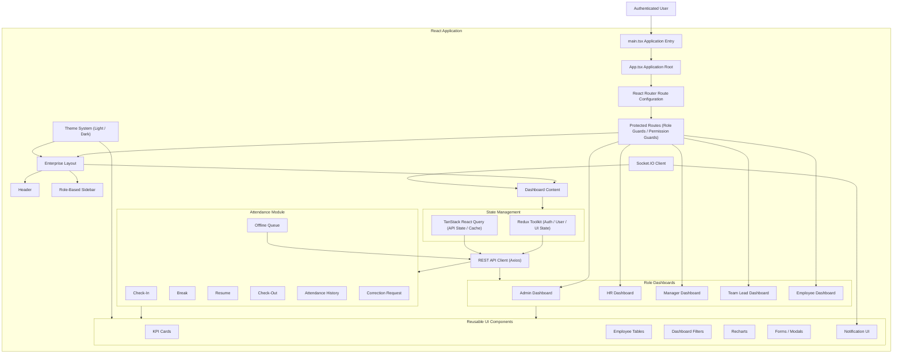
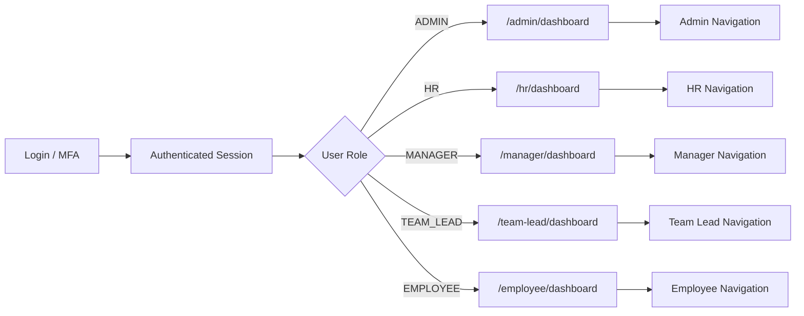

# 💻 Frontend Architecture

This document describes the design of the React SPA including navigation routing, component layouts, state management layers, custom theme layers, and real-time updates.

## 1. Frontend Component Structure

---

## 2. Frontend Role-Based Routing

