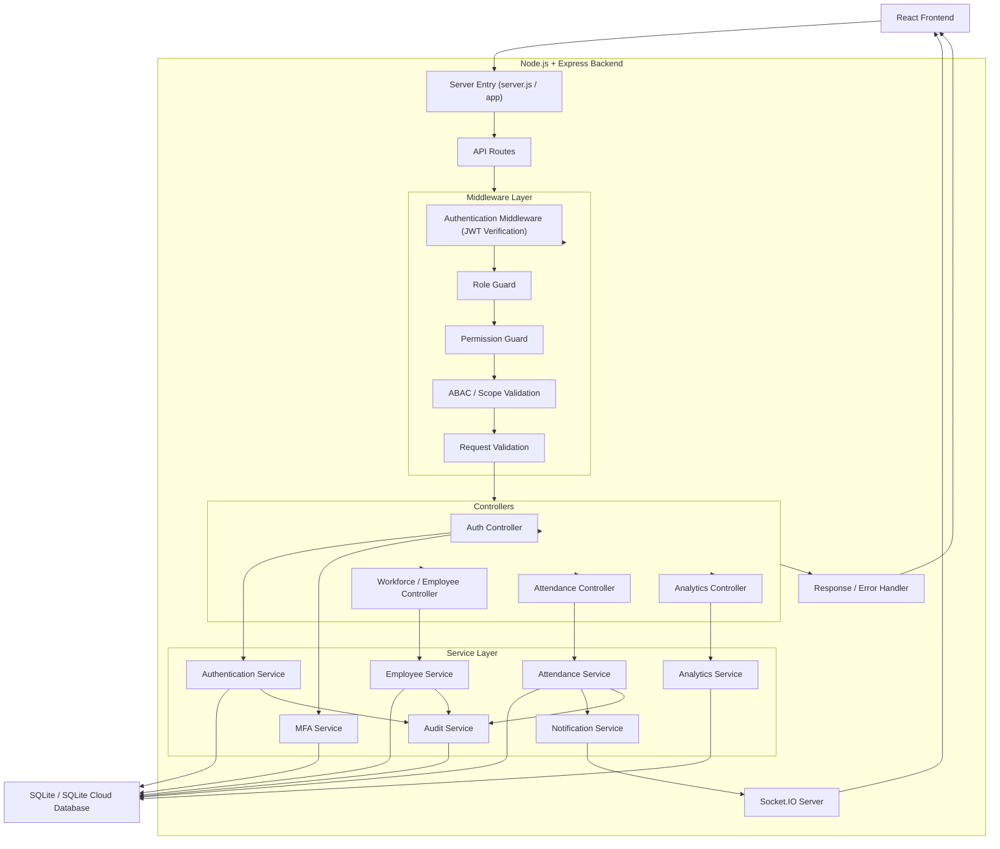

# ⚙️ Backend Architecture

This document outlines the architectural organization of the Express API, routing, controllers, services, middleware authorization, Socket.io events, and integrations.

```mermaid
flowchart TB
    CLIENT["React Frontend"]
    subgraph SERVER["Node.js + Express Backend"]
        ENTRY["Server Entry (server.js / app)"]
        ROUTES["API Routes"]
        subgraph MIDDLEWARE["Middleware Layer"]
            AUTH_MW["Authentication Middleware (JWT Verification)"]
            ROLE_MW["Role Guard"]
            PERMISSION["Permission Guard"]
            ABAC["ABAC / Scope Validation"]
            VALIDATION["Request Validation"]
        end
        subgraph CONTROLLERS["Controllers"]
            AUTH_C["Auth Controller"]
            EMP_C["Workforce / Employee Controller"]
            ATT_C["Attendance Controller"]
            ANALYTICS_C["Analytics Controller"]
        end
        subgraph SERVICE_LAYER["Service Layer"]
            AUTH_S["Authentication Service"]
            MFA_S["MFA Service"]
            EMP_S["Employee Service"]
            ATT_S["Attendance Service"]
            ANALYTICS_S["Analytics Service"]
            NOTIFY_S["Notification Service"]
            AUDIT_S["Audit Service"]
        end
        SOCKET["Socket.IO Server"]
        RESPONSE["Response / Error Handler"]
    end
    DB["SQLite / SQLite Cloud Database"]
    CLIENT --> ENTRY
    ENTRY --> ROUTES
    ROUTES --> MIDDLEWARE
    MIDDLEWARE --> AUTH_MW
    AUTH_MW --> ROLE_MW
    ROLE_MW --> PERMISSION
    PERMISSION --> ABAC
    ABAC --> VALIDATION
    VALIDATION --> CONTROLLERS
    CONTROLLERS --> AUTH_C
    CONTROLLERS --> EMP_C
    CONTROLLERS --> ATT_C
    CONTROLLERS --> ANALYTICS_C
    AUTH_C --> AUTH_S
    AUTH_C --> MFA_S
    EMP_C --> EMP_S
    ATT_C --> ATT_S
    ANALYTICS_C --> ANALYTICS_S
    EMP_S --> DB
    ATT_S --> DB
    ANALYTICS_S --> DB
    AUTH_S --> DB
    MFA_S --> DB
    ATT_S --> NOTIFY_S
    ATT_S --> AUDIT_S
    EMP_S --> AUDIT_S
    AUTH_S --> AUDIT_S
    NOTIFY_S --> SOCKET
    AUDIT_S --> DB
    SOCKET --> CLIENT
    CONTROLLERS --> RESPONSE
    RESPONSE --> CLIENT
```
