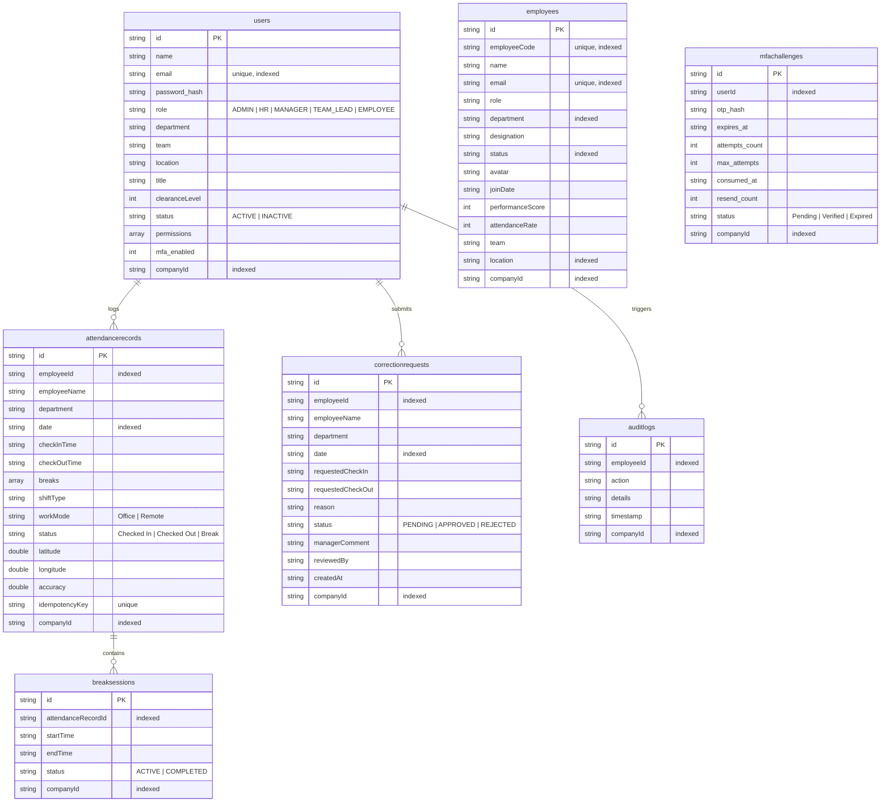

# 🗄️ Database Architecture

This document describes the SQLite database tables, schema structure, relationships, indexes, and columns in the Workforce Analytics system.

The database uses SQLite (local file database during development, and SQLite Cloud for production persistence), utilizing relational constraints, foreign keys, and indexes.

## 1. Database Tables Overview

## 2. Tables and Indexes

### Users Table (`users`)
- **Key Fields**: `id`, `email`, `password_hash`, `role`, `companyId`.
- **Indexes**:
  - `id`: Unique index for internal lookup references.
  - `email`: Unique index for authentication queries.
  - `companyId`: Index for multi-tenant isolation query scoping.

### Employees Table (`employees`)
- **Key Fields**: `id`, `employeeCode`, `name`, `email`, `department`, `location`, `companyId`.
- **Indexes**:
  - `id`: Unique lookup index.
  - `employeeCode`: Unique identifier index.
  - `email`: Unique email index.
  - `department`: Scoped queries for department filters.
  - `location`: Queries filtering employees by office branch.

### Attendance Table (`attendancerecords`)
- **Key Fields**: `id`, `employeeId`, `date`, `status`, `idempotencyKey`.
- **Indexes**:
  - `employeeId` + `date`: Compound index for daily logs lookup.
  - `idempotencyKey`: Unique index to prevent duplicate check-in API processing.

### Correction Requests Table (`correctionrequests`)
- **Key Fields**: `id`, `employeeId`, `date`, `status`.
- **Indexes**:
  - `employeeId`: Speeds up retrieval of individual submission logs.
  - `status`: Index to quickly locate pending approvals for managers.
