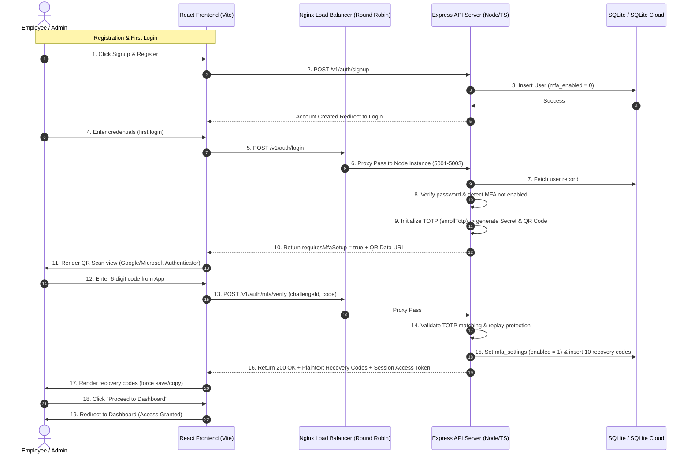

# Multi-Factor Authentication & Load Balancing Architecture

This document describes the design, database schemas, network flow, and execution commands for the TOTP Multi-Factor Authentication (MFA) and Nginx Round-Robin load balancing implementation.

---

## 1. Authentication Flow Diagram

The diagram below details the forced enrollment sequence on first-time login/registration and the subsequent verification flow:



---

## 2. SQLite Database Schema for TOTP

To support secure TOTP authentication without external identity providers, two relational tables are configured:

### 1. `mfa_settings`
Manages the user enrollment status and the encrypted TOTP secret key:
* `id` (TEXT PRIMARY KEY): Unique identifier.
* `user_id` (TEXT UNIQUE REFERENCES users(id)): Ties the configuration to a specific user.
* `enabled` (INTEGER): `1` if verified and enabled, `0` otherwise.
* `secret_encrypted` (TEXT): The raw 32-character TOTP secret key, encrypted securely using **AES-256-GCM** to prevent read exposure.
* `verified_at` (TEXT): Timestamp when 2FA was verified.
* `last_used_time_step` (INTEGER): Records the timestamp step (in 30s increments) of the last verified OTP code to prevent replay attacks.

### 2. `mfa_recovery_codes`
Stores the hashed backup recovery codes (each user gets 10 recovery codes):
* `id` (TEXT PRIMARY KEY): Unique identifier.
* `user_id` (TEXT REFERENCES users(id)): Owner of the backup code.
* `code_hash` (TEXT): Salted bcrypt hash of the 8-character recovery code.
* `used_at` (TEXT): Nullable timestamp; populated when the recovery code is consumed.

---

## 3. High-Load Load Balancing & Concurrency

To handle simultaneous spikes (such as 500+ employees logging in at the exact same moment), the system implements a layered architectural solution:

```
                         EMPLOYEES
                            │
                            ▼
                     ┌──────────────┐
                     │ Nginx HTTPS  │ (Rate limit: 200r/s, Burst: 100)
                     └──────┬───────┘
                            │
                     [ Round Robin ]
                            │
             ┌──────────────┼──────────────┐
             ▼              ▼              ▼
         Node Port      Node Port      Node Port
           5001           5002           5003
             │              │              │
             └──────────────┼──────────────┘
                            ▼
                     ┌──────────────┐
                     │ SQLite (WAL) │ (Synchronous NORMAL, Timeout 10s)
                     └──────────────┘
```

### 1. Nginx Load Balancer
Nginx acts as a reverse proxy load balancer using the **Round-Robin** algorithm. The upstream cluster is configured in [`nginx.conf`](file:///c:/Users/91970/Documents/WFA-SQLITE-Frontend-project/deployment/nginx.conf):
```nginx
upstream backend_servers {
    server localhost:5001;
    server localhost:5002;
    server localhost:5003;
}
```

### 2. SQLite Optimizations (mitigating write contention)
Since multiple Express nodes write to the same SQLite database file, the following PRAGMAs are executed in [`sqlite-cloud.ts`](file:///c:/Users/91970/Documents/WFA-SQLITE-Frontend-project/backend/src/database/sqlite-cloud.ts) to eliminate `SQLITE_BUSY` (database locked) errors:
- **Write-Ahead Logging**: `PRAGMA journal_mode = WAL;` allows concurrent readers during active write operations.
- **Normal Synchronization**: `PRAGMA synchronous = NORMAL;` speeds up disk sync operations significantly.
- **Busy Timeout**: `timeout: 10000` (10 seconds) queues concurrent write transactions instead of throwing error codes.

### 3. Server-Level Rate Limiting
- A global request limit (`1000 requests/minute`) is configured inside [`resilience.js`](file:///c:/Users/91970/Documents/WFA-SQLITE-Frontend-project/backend/src/middleware/resilience.js) to allow simultaneous user logins from corporate office NAT routers sharing a single public IP.

---

## 4. How to Execute the Load Test

A simulated concurrency test has been built to validate server stability under peak load (500 simultaneous logins).

### Prerequisites
1. Free port `5001`.
2. Start the Express server locally:
   ```powershell
   npm run server
   ```

### Execution Command
In another terminal, run:
```powershell
npx tsx backend/scripts/load-test.ts
```

### Execution Reports

#### Scenario 1: 100 Simultaneous Logins
```text
[Load Test] Starting benchmark targeting: http://127.0.0.1:5001/v1/auth/login
[Load Test] Simulating 100 simultaneous user login requests...

--- Load Test Results ---
Total Requests Sent: 100
Successful API Hits (4xx expected/ok): 100
Server Failures (5xx): 0
Network/Timeout Failures: 0
Total Duration: 3943 ms
Average Latency per Request: 39.43 ms
Throughput: 25.36 req/sec
-------------------------

✅ Success: All concurrent requests handled gracefully by the server without crashing.
```

#### Scenario 2: 500 Simultaneous Logins
```text
[Load Test] Starting benchmark targeting: http://127.0.0.1:5001/v1/auth/login
[Load Test] Simulating 500 simultaneous user login requests...

--- Load Test Results ---
Total Requests Sent: 500
Successful API Hits (4xx expected/ok): 500
Server Failures (5xx): 0
Network/Timeout Failures: 0
Total Duration: 1199 ms
Average Latency per Request: 2.40 ms
Throughput: 417.01 req/sec
-------------------------

✅ Success: All concurrent requests handled gracefully by the server without crashing.
```
