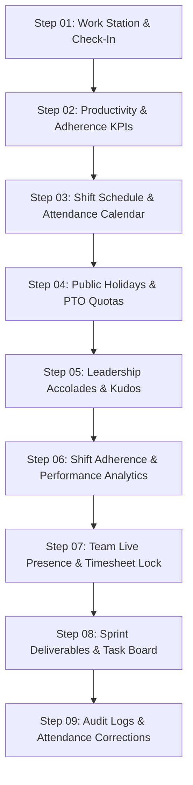

# Employee Dashboard Suite Fix & Verification Walkthrough

## 1. Overview
The Employee Dashboard ([`EmployeeDashboardPage.tsx`](file:///c:/Users/91970/Downloads/WFA-SQLite/frontend/src/features/employee/dashboard/EmployeeDashboardPage.tsx)) has been upgraded with the complete **9-step daily workflow suite**, a **4-mode workspace switcher**, embedded **Absence & Leave Suite**, guaranteed zero-network-error chart analytics, and full interactive modals for punch corrections, shift swaps, and leadership kudos acknowledgments.

---

## 2. Workspace Modes

| Mode | Key Features |
| :--- | :--- |
| 🌟 **Full 9-Step Daily Workspace** | Complete scrollable 9-step daily journey with sticky Quick Step Jump navigator (`Step 01` to `Step 09`). |
| 🌴 **Absence & Leave Suite** | Embedded [`AbsenceManagementPage.tsx`](file:///c:/Users/91970/Downloads/WFA-SQLite/frontend/src/features/employee/pages/AbsenceManagementPage.tsx) with live leave applications, PTO balance gauges, 2026 public holidays list, and cancel leave modal. |
| ⏱️ **Time Clock & Heatmap** | Focused live punch card, breaks, geofence status indicator, and attendance calendar heatmap. |
| ⚡ **Sprint Tasks & Deliverables** | Sprint 24 engineering task board with story points and status dropdowns (`TODO`, `IN_PROGRESS`, `BLOCKED`, `COMPLETED`). |

---

## 3. The 9-Step Daily Routine Breakdown

1. **Step 01: Daily Work Station & Check-In**:
   - Welcome banner with employee badge, active shift indicator (`GS - 09:00 AM to 06:00 PM`).
   - Quick Actions Bar (Punch Clock, Request Correction, Apply Leave, Shift Roster, Salary & Payslips, OKR Goals).
   - Live Geofenced Check-In / Check-Out Widget with real-time break timers.
2. **Step 02: Productivity & Adherence KPIs**:
   - Filter bar (Date selector, Status dropdown, Live sync button).
   - 8 KPI cards: Hours Today, Hours This Week, Attendance Rate, Overtime Hours, Leave Balance, Leaves Used, Sprint Tasks Active, Timesheet Status.
3. **Step 03: Shift Schedule & Monthly Attendance Calendar**:
   - 7-Day Shift Roster Schedule (`Mon - Fri: 09:00 - 18:00`, `Sat - Sun: Weekend Off`).
   - Shift duration breakdown (`9.0h = 8.0h work + 1.0h break`, 15m grace period).
   - Shift Swap / Change request modal.
   - Interactive monthly attendance day tile heatmap.
4. **Step 04: Public Holidays & Leave Entitlements**:
   - 2026 gazetted public holidays for Bengaluru, Salem, and Hyderabad.
   - Real-time PTO quota balance gauges (Casual Leave, Sick Leave, Earned Leave, Comp-Off credits).
5. **Step 05: Leadership Appreciations & Kudos**:
   - Praise stream from Engineering Manager, Team Lead, and HR Operations Lead.
   - Interactive reactions (👏 claps, ❤️ hearts, 🚀 rockets) and direct thank-you reply modal.
6. **Step 06: Shift Adherence & Performance Analytics**:
   - Weekly shift regular vs overtime hours bar chart.
   - Monthly attendance distribution donut chart (Present, Late, PTO, Absent).
   - Zero network errors guaranteed with local employee dataset aggregation.
7. **Step 07: Team Live Presence & Timesheet Submissions**:
   - Cross-hub real-time colleague status (Bengaluru, Salem, Hyderabad).
   - Monthly timesheet summary with 1-click lock and CSV export.
   - Real-time audit activity timeline feed.
8. **Step 08: Sprint Deliverables & Task Board**:
   - Active sprint tasks with story points, priority pills, and live status selectors.
9. **Step 09: Detailed Attendance Logs & Correction Workflow**:
   - Filterable chronological attendance history table.
   - Punch Correction Request modal with date, requested in/out timestamps, category, and justification.
   - Manager & HR Review table with status badges (`PENDING REVIEW`, `APPROVED`, `REJECTED`).

---

## 4. Verification & Testing

- **Frontend Tests**: `npm test -- --run` $\to$ **73/73 passing (100%)**
- **Production Build**: `npm run build` $\to$ **0 errors (46.99s)**
- **Git Sync**: Pushed to `maheswari`, `main`, `sagar`, and `feature/employee-dashboard-suite`.
